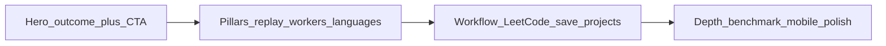

# Killer features for the dStruct landing page

Research-backed differentiators, positioning, FAQ, and pointers into the codebase. Use when writing the [home page](../../src/pages/index.tsx), i18n strings, or external marketing. **Implementation todos** are in the YAML frontmatter above.

---

## Positioning (one line)

**dStruct is a LeetCode-oriented playground where your solution drives a time-synced visual debugger**—trees, graphs, grids, arrays, linked structures, and nested maps—with **JavaScript and Python**, **steppable replay**, and optional **micro-benchmarking** (JS).

---

## What the product is (anchor)

dStruct is a **LeetCode-oriented playground**: Monaco editor + run → **instrumented execution** produces a **callstack of structural operations** that drives **animated 2D visualizations** (trees, lists, graphs, arrays/matrices, maps/sets/objects, etc.). Auth + DB back **saved playground projects** (code, multiple solutions, test cases, public browse).

**Docs / schema:** [README.md](../../README.md), [prisma/schema.prisma](../../prisma/schema.prisma) (`ProjectCategory`, `PlaygroundProject`), [docs/CODE_EXECUTION_STATE.md](../../docs/CODE_EXECUTION_STATE.md).

---

## Hero pillars (above the fold)

Strongest differentiated claims:

1. **See your algorithm, not just stdout** (not a canned animation)
   Instrumented APIs record **replayable frames** (`[callstackSlice](../../src/features/callstack/model/callstackSlice.ts)`, `[useNodesRuntimeUpdates](../../src/features/treeViewer/hooks/useNodesRuntimeUpdates.ts)` — `applyFrame` / `revertFrame`). Position as understanding and debugging, not “another online IDE.”
2. **Separate-thread execution: responsive UI**

- **Main thread:** layout, paint, most React/DOM work — keep it free for a smooth editor and canvas.
- **Web Worker:** parallel JS thread; solution runs there so tight loops **do not block** the main thread.
- **JavaScript:** `[codeExec.worker.ts](../../src/features/codeRunner/lib/workers/codeExec.worker.ts)`, `[useJSWorker](../../src/features/codeRunner/hooks/useJSWorker.ts)`, `[useJSCodeRunner](../../src/features/codeRunner/hooks/useJSCodeRunner.ts)`.
- **Python:** **Pyodide** in `[pythonExec.worker.ts](../../src/features/codeRunner/lib/workers/pythonExec.worker.ts)` ([docs/PYTHON_PYODIDE.md](../../docs/PYTHON_PYODIDE.md)) — same idea; shared `**ExecutionResult` with JS.
- **Honest copy:** Pyodide **preloads** when you open a Python page (worker `init` on mount — see `[usePythonCodeRunner](../../src/features/codeRunner/hooks/usePythonCodeRunner.tsx)`); first visit pulls **~30 MB** (then cached); WASM startup still takes **a few seconds** even from cache. Default Python needs **no backend**. Pair **responsive UI** with **local execution**. Avoid “instant” / “zero delay.”

1. **Time-travel through the run**
   Step forward/back, play/pause, replay, playback speed slider, keyboard shortcuts (←/→, space, r, Esc): `[PlayerControls](../../src/features/treeViewer/ui/PlayerControls.tsx)`, `[usePlayerControls](../../src/features/treeViewer/hooks/usePlayerControls.ts)`.
2. **Measure, don’t guess (JS only)**
   **Benchmark:** **128 iterations** by default (`[useCodeExecution](../../src/features/codeRunner/hooks/useCodeExecution.ts)`), live progress, avg / median / p75–p99 + chart (`[BenchmarkView](../../src/features/benchmark/ui/BenchmarkView.tsx)`, `[codeExec.worker.ts](../../src/features/codeRunner/lib/workers/codeExec.worker.ts)`). **Not available for Python** (`[CodePanel](../../src/features/codeRunner/ui/CodePanel.tsx)`).

**Optional fifth pillar / sub-hero:** **Structure coverage** — binary trees, BST, linked lists, graphs, grids/matrices, heaps, stacks, trie, DP, two pointers, sliding window, backtracking, etc. (`[ProjectCategory](../../prisma/schema.prisma)`, `[TreeViewer](../../src/features/treeViewer/ui/TreeViewer.tsx)`).

---

## Supporting themes (mid-page)

| Theme                 | What to say                                                                               | Code                                                                                                                                                                                                                                                                                                                                                      |
| --------------------- | ----------------------------------------------------------------------------------------- | --------------------------------------------------------------------------------------------------------------------------------------------------------------------------------------------------------------------------------------------------------------------------------------------------------------------------------------------------------- |
| Breadth               | Categories + argument types (trees, graph, list, array, matrix, string, set, map, object) | [schema](../../prisma/schema.prisma), `[ArgumentType](../../src/entities/argument/model/argumentObject.ts)`                                                                                                                                                                                                                                               |
| Playback & inspection | Virtualized operation log; **relative timestamps**; hover highlights nodes                | `[CallstackTable](../../src/features/callstack/ui/CallstackTable.tsx)`                                                                                                                                                                                                                                                                                    |
| Styling from code     | `setColor`, `setColorMap`, animations (blink/pulse)                                       | `[NodeBase](../../src/entities/dataStructures/node/model/nodeBase.ts)`, `[NodeBase` UI](../../src/features/treeViewer/ui/NodeBase.tsx)                                                                                                                                                                                                                    |
| Graphs                | Directed edges, weights/labels, gradients; drag positions in edit mode                    | `[useArgumentsParsing](../../src/features/treeViewer/hooks/useArgumentsParsing.ts)`, `[GraphEdge](../../src/entities/dataStructures/graph/ui/GraphEdge.tsx)`, `[GraphNode](../../src/entities/dataStructures/graph/ui/GraphNode.tsx)`, `[TreeViewPanel](../../src/features/treeViewer/ui/TreeViewPanel.tsx)`                                              |
| Pan & zoom            | Pannable canvas                                                                           | `[PannableViewer](../../src/shared/ui/templates/PannableViewer.tsx)`                                                                                                                                                                                                                                                                                      |
| Nested structures     | Map rows → nested children (Trie-style)                                                   | `[NestedStructure](../../src/features/treeViewer/ui/NestedStructure.tsx)`, `[MapItem](../../src/entities/dataStructures/map/ui/MapItem.tsx)`                                                                                                                                                                                                              |
| Grids                 | `MatrixStructureView` in TreeViewer; examples in dumps                                    | `[TreeViewer](../../src/features/treeViewer/ui/TreeViewer.tsx)`, [public-dumps/main.json](../../public-dumps/main.json)                                                                                                                                                                                                                                   |
| Editor layout         | Resizable panels                                                                          | [package.json](../../package.json) (`react-resizable-panels`)                                                                                                                                                                                                                                                                                             |
| Mobile                | Browse / code / results; keep-alive across tabs                                           | [docs/MOBILE_PLAYGROUND.md](../../docs/MOBILE_PLAYGROUND.md)                                                                                                                                                                                                                                                                                              |
| Cloud projects        | Many cases, named solutions, JS + Python, `lcLink`, public/private                        | [schema](../../prisma/schema.prisma), `[project` router](../../src/server/api/routers/project.ts)                                                                                                                                                                                                                                                         |
| LeetCode workflow     | URL metadata fetch, account link, daily problem, open on LC                               | `[ProjectModal](../../src/features/project/ui/ProjectModal.tsx)`, `[leetcode` router](../../src/server/api/routers/leetcode.ts), `[UserSettings](../../src/features/profile/ui/UserSettings.tsx)`, `[DailyProblem](../../src/features/homePage/ui/DailyProblem/DailyProblem.tsx)`, `[ProblemLinkButton](../../src/shared/ui/atoms/ProblemLinkButton.tsx)` |
| Polish                | 3D **hero** logo (R3F + GLB), i18n, auth                                                  | `[LogoModelView](../../src/shared/ui/molecules/LogoModelView.tsx)`, `[src/3d-models](../../src/3d-models)`                                                                                                                                                                                                                                                |

---

## What not to oversell

- **3D** = branding on the home hero, **not** the main 2D algorithm canvas.
- **Benchmark** = JavaScript only.
- **Python** first-load and limits → **FAQ**, not the hero headline.

---

## Proof CTAs (playground URLs)

Existing home CTA: `/playground/invert-binary-tree?view=code` ([index.tsx](../../src/pages/index.tsx)). Add verified slugs for:

- Tree (invert / traverse / reconstruct-style)
- Graph (BFS/DFS, coloring)
- Grid (matrix BFS-style — see dumps)
- Trie (map + nested display)

---

## Landing information architecture

1. Hero — outcome + primary CTA + Browse
2. How it works — Run → frames → scrub (3 steps)
3. Structure coverage — cards or icons
4. Languages & execution — Pyodide + workers (link [PYTHON_PYODIDE.md](../../docs/PYTHON_PYODIDE.md))
5. Workflow — LeetCode URL / account / daily + cloud saves
6. Footer / FAQ — benchmark JS-only, Python caveats; license = [LICENSE](../../LICENSE)

---

## Copy practices

- Lead with **job-to-be-done** (“visual walkthrough from your code”) before stack names.
- One technical proof per claim in tooltips / footnotes.
- Prefer **“main thread stays responsive”** and **“scrub steps”** over absolute latency claims ([docs/CODE_EXECUTION_STATE.md](../../docs/CODE_EXECUTION_STATE.md)).
- Audiences: learners (replay + callstack), interviews (benchmark), sharers (public projects).

### Threading cheat sheet (hero)

| Say                                                      | Avoid                                  |
| -------------------------------------------------------- | -------------------------------------- |
| Web Worker = **separate JS thread**; UI stays **smooth** | Vague “off the UI thread”              |
| **Responsive UI** + **local execution**                  | “Instant” / “zero delay”               |
| Pyodide in a worker = same **non-blocking** idea         | Implying the worker _is_ the UI thread |

**Title idea:** Background-thread execution, fluid interface

**Body idea:** JS runs in a **Web Worker** so the editor and visualization stay **interactive** under load; Python uses **Pyodide in a worker** the same way.

---

## Feature cards (6–8 + “And more”)

1. Visual replay (step / scrub / speed)
2. JS worker + Pyodide — responsive UI, default Python without server
3. Benchmark — 128× default, percentiles + chart (JS)
4. Broad categories + argument types
5. Colors, color maps, animations from code
6. Cloud projects, cases, dual-language solutions, browse
7. Graph layout, pan/zoom, nested map/trie views
8. LeetCode: URL fetch, account, daily, deep links

Defer generic README **tech stack** unless you add a “For developers” section.

---

## Source files for copy

- [docs/PYTHON_PYODIDE.md](../../docs/PYTHON_PYODIDE.md)
- [docs/CODE_EXECUTION_STATE.md](../../docs/CODE_EXECUTION_STATE.md)
- [docs/MOBILE_PLAYGROUND.md](../../docs/MOBILE_PLAYGROUND.md)
- [prisma/schema.prisma](../../prisma/schema.prisma)
- [src/pages/index.tsx](../../src/pages/index.tsx)
- [src/features/treeViewer/](../../src/features/treeViewer/) · [src/features/codeRunner/](../../src/features/codeRunner/)

---

## FAQ (landing)

Questions users are **likely to ask when trying the product**. Tone: honest, no hype. Implement with i18n; anchor e.g. `id="faq"`.

**Why don’t I see a visualization after I run my code?**  
The animation comes from **dStruct’s tracked data-structure APIs** (trees, lists, graphs, arrays, maps, etc.), not from ordinary variables. Choose a **project category** that matches your problem, keep inputs in the expected shape, and use the **wrapper types / patterns** the playground provides. If you only mutate plain objects or arrays without those APIs, you may get output but **no step-by-step replay**.

**What kinds of problems and structures can I use?**  
Many **LeetCode-style** categories: trees, BST, linked lists, **graphs**, **grids** / matrices, arrays, heaps, stacks, **trie**, DP, two pointers, sliding window, backtracking, and more. See **Browse** in the playground and the category list in the app when creating a project.

**Do I need to install Python or anything else on my computer?**  
**No** for normal use in the browser. **JavaScript** runs in a **Web Worker**; **Python** runs via **Pyodide** (in-browser CPython).

**When I click Run, is my code executed on your servers?**  
For the **default** setup, **no** — runs happen **in your browser** (workers). **Saving** projects, signing in, and browsing cloud data use dStruct’s backend like any web app; the **execution** of your solution for visualization is local unless you deliberately use legacy server Python mode.

**Can I use both JavaScript and Python?**  
**Yes.** Projects can hold **separate JS and Python** solution snippets. Some features differ: e.g. **Benchmark** (timing many runs) is **JavaScript-only** today.

**Why is Python slow to start / why do I see a loading bar?**  
Pyodide is **preloaded in the background** as soon as you open a **Python** solution page (not only when you press Run — see `[usePythonCodeRunner](../../src/features/codeRunner/hooks/usePythonCodeRunner.tsx)`). The worker **downloads** the runtime on the **first visit** to the site (**~30 MB**, then **browser cache**), installs the harness, and **initializes** WASM — often **a few seconds** even when files are cached. Once that finishes, **Run** is usually quick for typical problem sizes.

**Can I use NumPy, pandas, or `pip install` in Python?**  
**No** in the bundled playground — **standard library only**. Third-party imports fail with `ModuleNotFoundError`. Details: [PYTHON_PYODIDE.md](../../docs/PYTHON_PYODIDE.md).

**How long can one run take?**  
Python runs time out after **30 seconds** by default; the worker is then **terminated** and recreated. There is no finer-grained cancellation inside long WASM work.

**How do I save my solutions and test cases? Do I need an account?**  
You can open **public** projects and experiment **without** signing in. To **persist** your own projects, multiple **test cases**, and **named solutions** in the cloud, **sign in** with the providers the app offers.

**Can I share my work or learn from others’ projects?**  
**Yes.** You can mark projects **public** and use **Browse** to discover examples. Exact visibility options follow the in-app project settings.

**What does linking my LeetCode account do?**  
Optional: profile-related features in the app, pasting a **LeetCode problem URL** to **fill title / difficulty / metadata**, and shortcuts to **open the same problem on LeetCode**. Submitting and judging solutions still happens **on LeetCode** (or elsewhere)—dStruct is a **companion** visual playground.

**Can I measure how fast my solution is?**  
**Yes, for JavaScript** — use **Benchmark** mode (many iterations, stats like median and percentiles, chart). **Python** does not have benchmark mode in the product yet.

**Does dStruct work on a phone or tablet?**  
There is a **mobile-friendly** playground flow (browse / code / results) with **keep-alive** when switching tabs. **Writing and debugging** long solutions is still easiest on **desktop**. See [MOBILE_PLAYGROUND.md](../../docs/MOBILE_PLAYGROUND.md).

**Is dStruct open source?**  
**Yes.** License: [LICENSE](../../LICENSE) (**AGPL-3.0**). If other docs mention a different license, **LICENSE** is authoritative until they are updated.

---

## FAQ implementation notes

- MUI `Accordion` or Q&A list; deep link `#faq`.
- Strings via **typesafe-i18n** (`LL.`).
- Show **~10–12** questions on the page; optional “Advanced” accordion for Pyodide self-hosting, env vars, etc., linking to [PYTHON_PYODIDE.md](../../docs/PYTHON_PYODIDE.md).
