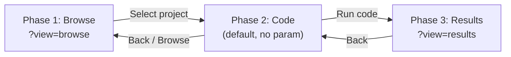

# Mobile Playground Phased Layout

## Current State

The mobile playground (`useMobileLayout() === true`) renders all 4 panels in a vertical `Stack` inside a scrollable `Container`:

```29:38:src/pages/playground/[[...slug]].tsx
  if (isMobile)
    return (
      <Container component="main" sx={{ pb: 4 }}>
        <Stack spacing={1} mt={1} pb={4}>
          <TopLeft />
          <TopRight />
          <BottomLeft />
          <BottomRight />
        </Stack>
      </Container>
    );
```

## Architecture

Introduce a `?view=browse|code|results` query parameter (managed via the existing `useSearchParam` hook) to control which phase is displayed on mobile. Each phase fills the viewport with no scroll on the page container. Browser back/forward buttons navigate between phases naturally since `useSearchParam` uses `router.push`.



## Key Files to Create / Modify

### New files

- `**src/features/playground/hooks/useMobilePlaygroundView.ts**` -- Hook wrapping `useSearchParam("view")` that provides `currentView`, `goToBrowse()`, `goToCode()`, `goToResults()`. Uses `router.push` for phase transitions so they go into browser history.
- `**src/features/playground/ui/MobilePlayground.tsx**` -- Top-level mobile layout component. Reads `currentView` and renders the correct phase view. Ensures the container is `height: calc(100vh - <appbar height>)` with `overflow: hidden`.
- `**src/features/playground/ui/MobileBrowseView.tsx**` -- Phase 1. Renders the ProjectBrowser content (search bar, category chips, virtualized project list) **inline as a full-screen view** rather than inside a Drawer. Reuses `ProjectBrowserCategoryBar`, `ProjectBrowserHeader`, `ProjectBrowserList` from `src/features/project/ui/ProjectBrowser/`. On project selection, calls `goToCode()`.
- `**src/features/playground/ui/MobileCodeView.tsx` -- Phase 2. Two-panel vertical layout:
  - **Top**: `ArgsEditor` wrapped in a collapsible section (collapsed shows just a compact header bar; expanded shows the full args editor with a max-height constraint). The `ProjectInfo` and `TestCaseSelectBar` from `ProjectPanel` are placed in the header bar so they remain visible when collapsed.
  - **Bottom**: `CodePanel` taking all remaining space (`flex: 1`). The `Run` button action additionally calls `goToResults()` after execution completes.
  - No vertical scroll on the outer container.
- `**src/features/playground/ui/MobileResultsView.tsx` -- Phase 3. Two-panel vertical layout:
  - **Top**: `TreeViewPanel` taking most space (`flex: 1`).
  - **Bottom**: `OutputPanel` in a collapsible section (collapsed = just the tab header; expanded = up to ~40% of remaining height).
  - No vertical scroll on the outer container.
- `**src/features/playground/ui/CollapsiblePanel.tsx` -- Reusable component for the collapse/expand mechanism. Props: `collapsed`, `onToggle`, `headerContent`, `children`, `collapsedHeight` (default ~48px for tab bar). Uses MUI `Collapse` or simple height animation. When collapsed, only the header is shown; when expanded, panel gets a configurable max share of the viewport.

### Modified files

- `**[src/pages/playground/[[...slug]].tsx](src/pages/playground/[[...slug]].tsx)` -- In the mobile branch, replace the `Container`+`Stack` with `<MobilePlayground />`. The desktop branch stays unchanged.
- `**[src/features/appBar/ui/MainAppBar.tsx](src/features/appBar/ui/MainAppBar.tsx)` -- On mobile, when on the playground page:
  - Reduce toolbar height from 56px to 48px.
  - Replace the hamburger menu + "dStruct" text with a compact layout: back arrow (navigates to previous phase or home), a phase title/breadcrumb (e.g., "Browse" / "Code" / "Results"), and forward navigation when applicable.
  - Keep the FolderOpen icon (opens browse phase instead of the drawer), user avatar/settings on the right.
  - The `Run` button could optionally be surfaced in the app bar for phase 2 (code) to save vertical space within the code panel. This is optional and can be deferred.
- `**[src/features/project/ui/ProjectBrowser/ProjectBrowserContext.tsx](src/features/project/ui/ProjectBrowser/ProjectBrowserContext.tsx)` -- Add an `onSelectProject` callback to context so `MobileBrowseView` can hook into project selection to trigger phase transition.
- `**[src/features/project/ui/ProjectPanel.tsx](src/features/project/ui/ProjectPanel.tsx)` -- Extract `ProjectInfo`, `TestCaseSelectBar`, and `ArgsEditor` rendering logic so `MobileCodeView` can compose them independently without the full `PanelWrapper`+`TabContext` chrome. This could be done by exporting a `ProjectPanelContent` sub-component or by making the inner content a separate composable piece.
- `**[src/features/codeRunner/ui/CodePanel.tsx](src/features/codeRunner/ui/CodePanel.tsx)` -- Expose a way for `MobileCodeView` to hook into the "run complete" event so it can trigger `goToResults()`. One approach: accept an optional `onRunComplete` prop, or use a Redux action that `MobileCodeView` listens to (the `callstackSlice.actions.setStatus` dispatched when code finishes could serve this purpose -- `MobileCodeView` watches `selectCallstackIsReady` and transitions when it becomes `true`).
- `**[src/features/treeViewer/ui/TreeViewPanel.tsx](src/features/treeViewer/ui/TreeViewPanel.tsx)` -- Remove the `isMobile ? "70vh" : "100%"` hardcoded height. On mobile, the parent container will control sizing.
- `**[src/shared/hooks/useMobileLayout.ts](src/shared/hooks/useMobileLayout.ts)` -- No changes needed, but referenced throughout.

## Phase Navigation UX

- **Phase 1 -> Phase 2**: Selecting a project calls `goToCode()` which does `router.push` with `view` param removed (code is default).
- **Phase 2 -> Phase 3**: Running code sets results ready in Redux. `MobileCodeView` detects `selectCallstackIsReady` becoming true and calls `goToResults()`.
- **Phase 3 -> Phase 2**: Back button in app bar (or browser back) calls `goToCode()`.
- **Phase 2 -> Phase 1**: Back button in app bar or tapping the project browser icon calls `goToBrowse()`.
- **Browser back/forward**: Works naturally because `useSearchParam` uses `router.push` (adds to history stack).

## Collapsible Panel Behavior

- `CollapsiblePanel` animates between collapsed (header only, ~48px) and expanded states.
- A small toggle button (chevron up/down) in the header triggers collapse/expand.
- In Phase 2, the args panel starts expanded but can be collapsed to give more room to the code editor.
- In Phase 3, the output panel starts collapsed but can be expanded to inspect results.
- The main panel in each phase uses `flex: 1` to fill all remaining space dynamically.

## No-Scroll Guarantee

Each phase view uses this layout pattern:

```tsx
<Box
  sx={{
    height: "calc(100vh - 48px)",
    display: "flex",
    flexDirection: "column",
    overflow: "hidden",
  }}
>
  <CollapsiblePanel>{/* secondary panel */}</CollapsiblePanel>
  <Box sx={{ flex: 1, minHeight: 0, overflow: "hidden" }}>
    {/* primary panel */}
  </Box>
</Box>
```

The `minHeight: 0` on the flex child prevents content from expanding beyond the available space. Each panel manages its own internal scroll if needed (e.g., `OverlayScrollbarsComponent` within `StyledTabPanel`).
