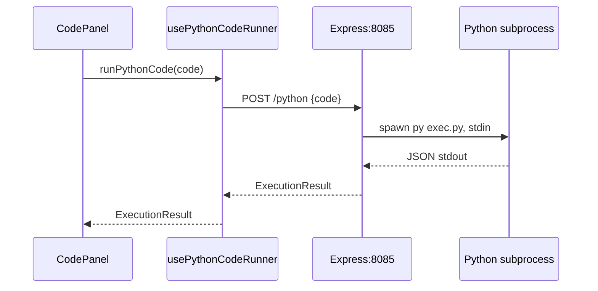
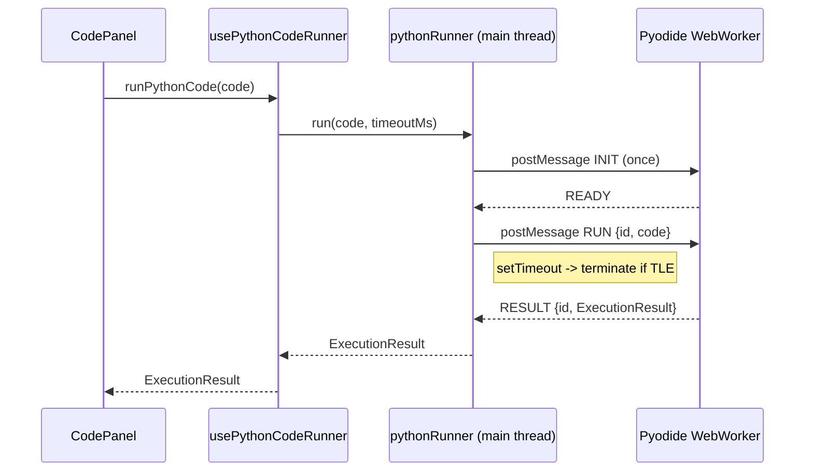

# Pyodide Web Worker Python Runner

## Current Architecture (what we're replacing)



**Key surfaces:**

- Runner hook: `[src/features/codeRunner/hooks/usePythonCodeRunner.ts](src/features/codeRunner/hooks/usePythonCodeRunner.ts)` -- calls `fetch("http://localhost:8085/python")`
- Unified orchestrator: `[src/features/codeRunner/hooks/useCodeExecution.ts](src/features/codeRunner/hooks/useCodeExecution.ts)` -- calls `runPythonCode(codeInput)` at line 157, expects `ExecutionResult`
- Python harness: `[src/packages/dstruct-runner/python/exec.py](src/packages/dstruct-runner/python/exec.py)` -- `safe_exec()` does AST transform + execute, returns `ExecutionResult`
- Supporting Python: `array_tracker.py`, `array_tracker_transformer.py`, `output.py`, `shared_types.py`

`**ExecutionResult` shape (the contract we must preserve):

```typescript
interface ExecutionResult {
  output: string;
  callstack: any[];
  runtime: number;
  startTimestamp: number;
  error?: { name: string; message: string; stack?: string };
}
```

## New Architecture



## File Changes

### 1. New: Pyodide Worker (`src/features/codeRunner/lib/workers/pythonExec.worker.ts`)

Web Worker that:

- On `INIT` message: loads Pyodide from CDN (configurable `indexURL`), installs the Python harness modules into the Pyodide filesystem (`pyodide.FS`), marks ready.
- On `RUN` message: receives `{ requestId, code }`, runs the full `safe_exec` pipeline via `pyodide.runPythonAsync()`, captures stdout/stderr by redirecting `sys.stdout`/`sys.stderr` to `io.StringIO`, posts back `{ requestId, result: ExecutionResult }`.
- Python files (`exec.py`, `array_tracker.py`, `array_tracker_transformer.py`, `output.py`, `shared_types.py`) will be embedded as string constants (imported via raw-loader `.txt` or inline) and written to the Pyodide FS at init time. This avoids any fetch at runtime.

Worker message protocol:

```typescript
// Main -> Worker
type WorkerInMessage =
  | { type: "INIT"; indexURL?: string }
  | { type: "RUN"; requestId: string; code: string };

// Worker -> Main
type WorkerOutMessage =
  | { type: "READY" }
  | { type: "RUN_RESULT"; requestId: string; result: ExecutionResult }
  | {
      type: "ERROR";
      requestId: string;
      error: { name: string; message: string; stack?: string };
    };
```

Decision: **serialize calls** (one RUN at a time) since we have a single warm worker. A `requestId` is still included for correctness, but the main-thread runner queues requests. This keeps the worker simple and avoids Python GIL complications.

### 2. New: Main-thread runner (`src/features/codeRunner/lib/pythonRunner.ts`)

A class/module (not a hook) providing:

- `init()` -- creates the worker, sends `INIT`, resolves when `READY` received. Safe to call multiple times (no-op if already ready).
- `run(code: string, timeoutMs?: number): Promise<ExecutionResult>` -- posts `RUN` to worker, returns promise. On timeout: `worker.terminate()`, reject with a TLE-shaped `ExecutionResult`, auto-recreate worker via `init()`.
- `dispose()` -- terminates worker, cleans up.
- Internal: manages worker lifecycle, auto-recreate on crash/error.

### 3. Refactor: `usePythonCodeRunner.ts`

Replace the `fetch()` mutation with a call to the new `pythonRunner.run()`. Remove the `PythonSupportModal` trigger on error (Python now always works in-browser). Keep the same hook signature: `{ runPythonCode, isProcessing }`.

### 4. Update: `usePythonCodeRunner.ts` -- preload on mount

Call `pythonRunner.init()` eagerly when the hook mounts (i.e., when user enters a Python problem page), so Pyodide is warm by the time they click Run.

### 5. Update: `PythonSupportModal`

Update the modal text (or remove the modal entirely) since Python no longer requires a local server. The modal was only shown when the `fetch` to `localhost:8085` failed. We can keep it as a fallback error display or remove the `onError` path.

### 6. Install `pyodide` npm package

Run `pnpm add pyodide`. This provides types and the CDN URL helper. Pyodide WASM assets load from CDN at runtime (no need to self-host initially).

### 7. Python harness embedding

Copy the 5 Python files as raw text into the worker. Two approaches:

- **Option A (preferred):** Import them using the existing raw-loader config (`*.txt`) by creating `.py.txt` copies or adding a `*.py` raw-loader rule to `next.config.mjs`.
- **Option B:** Inline them as template literals in a `pythonHarness.ts` constants file.

We'll go with **Option A**: add a webpack/turbopack rule for `*.py` files as raw text, then `import execPy from "./python/exec.py"` inside the worker. This keeps the Python files editable as real `.py` files.

### 8. Next.js config for worker + .py raw imports

In `[next.config.mjs](next.config.mjs)`:

- Add `*.py` to both turbopack rules and webpack rules (same pattern as existing `*.txt` rule).
- The worker file itself (`pythonExec.worker.ts`) uses `new Worker(new URL(..., import.meta.url))` which Next.js/webpack supports natively (same pattern as existing JS worker).

### 9. Feature flag (optional, lightweight)

Add an env var `NEXT_PUBLIC_PYTHON_EXEC_MODE` with values `pyodide` (default) or `server`. In `usePythonCodeRunner`, branch on it. This lets us fall back to the old server mode during development if needed. Default to `pyodide` so no env setup is needed.

### 10. Smoke test script

Add a minimal `src/features/codeRunner/lib/workers/__tests__/pythonExec.worker.spec.ts` using vitest + `@vitest/web-worker` that:

- Instantiates the worker
- Sends INIT, asserts READY
- Sends a simple Python snippet, asserts the returned `ExecutionResult` shape

### 11. Documentation

Add a section to the project README or a new `docs/PYTHON_PYODIDE.md` with:

- How pyodide mode works
- Where runtime assets come from (CDN by default, self-host instructions)
- Known limitations (stdlib only, no pip, cold start ~2-3s, memory)

## What stays unchanged

- `[src/features/codeRunner/hooks/useCodeExecution.ts](src/features/codeRunner/hooks/useCodeExecution.ts)` -- no changes needed (calls `runPythonCode` which keeps same signature)
- `[src/features/callstack/model/callstackSlice.ts](src/features/callstack/model/callstackSlice.ts)` -- untouched
- `[src/features/output/ui/OutputPanel.tsx](src/features/output/ui/OutputPanel.tsx)` -- untouched
- All Python harness logic (`exec.py`, `array_tracker.py`, etc.) -- preserved as-is, just loaded into Pyodide FS
- The `dstruct-runner` package -- left in place (can be removed later), just no longer called from frontend by default
