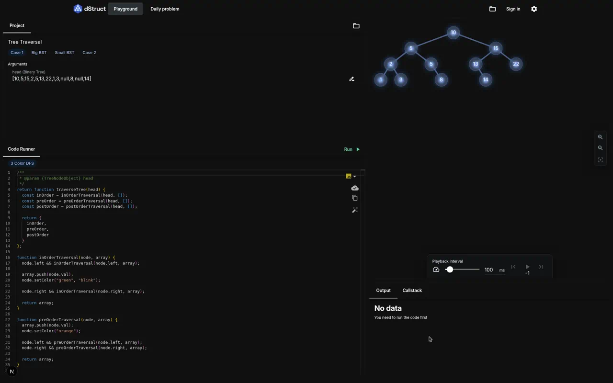

# dStruct

**See algorithms run. Understand data structures.**

[dstruct.pro](https://dstruct.pro) is an interactive playground for LeetCode-style problems. Write JavaScript or Python, run your code in the browser, and watch data structures update step by step — trees, graphs, linked lists, and more.

<p align="center">
  <a href="https://dstruct.pro">
    
  </a>
  <a href="LICENSE">
    
  </a>
</p>

<p align="center">
  <a href="https://dstruct.pro/playground/tree-traversal">
    
  </a>
</p>

<p align="center">
  <a href="https://dstruct.pro/playground"><strong>Try the playground</strong></a>
  &nbsp;·&nbsp;
  <a href="https://dstruct.pro/daily"><strong>Daily problem</strong></a>
</p>

---

## Why dStruct?

Most coding platforms show you pass/fail. dStruct shows you **what your code is doing** to the underlying data structure.

- Pick a problem and test case
- Write a solution in the built-in editor
- Run it and scrub through each step with playback controls
- Inspect output and the call stack as execution unfolds

It is built for learners who want intuition, not just green checkmarks.

## Features

|                                |                                                                                              |
| ------------------------------ | -------------------------------------------------------------------------------------------- |
| **Interactive visualizations** | 2D and 3D views of trees, graphs, arrays, and other structures that update as your code runs |
| **In-browser code execution**  | JavaScript and Python (via Pyodide) — no local interpreter setup required                    |
| **Monaco editor**              | Syntax highlighting, familiar editing experience                                             |
| **Step-by-step playback**      | Pause, step forward/back, and adjust speed to follow the algorithm                           |
| **Curated problems**           | Public playground projects with multiple test cases                                          |
| **Daily challenge**            | A rotating problem to practice on                                                            |
| **Sign in & save progress**    | Optional accounts via NextAuth (GitHub, Google)                                              |
| **Multilingual UI**            | English plus additional locales via typesafe-i18n                                            |

## Quick start

### Prerequisites

- **Node.js 24** (see `.nvmrc`)
- **pnpm** (`corepack enable`; the repository pins the supported version)
- **PostgreSQL** or **Docker**

### 1. Clone and install

```bash
git clone https://github.com/mkayander/dStruct.git
cd dStruct
cp .env.example .env   # edit if needed; placeholders work for basic local dev
pnpm install
```

### 2. Start PostgreSQL

The quickest option is a local Docker container matching `.env.example`:

```bash
docker run --name dstruct-postgres \
  -e POSTGRES_USER=dstruct \
  -e POSTGRES_PASSWORD=dstruct \
  -e POSTGRES_DB=dstruct \
  -p 5432:5432 \
  -d postgres:17
```

If you already run PostgreSQL, create a `dstruct` role and database (or update
`DATABASE_URL` in `.env` to use your existing credentials).

Then apply the schema and load the public playground problems:

```bash
pnpm prisma:push
pnpm loadMainDump
```

### 3. Start the dev server

```bash
pnpm dev
```

Open [http://localhost:3000](http://localhost:3000). The playground is at `/playground`.

For more detail (Cloud Agent setup, env vars, fonts, dump sync), see **[AGENTS.md](AGENTS.md)**.

## Environment variables

Copy [`.env.example`](.env.example) to `.env`. For local development you mainly need:

| Variable                      | Purpose                                    |
| ----------------------------- | ------------------------------------------ |
| `DATABASE_URL`                | PostgreSQL connection string               |
| `PRISMA_FIELD_ENCRYPTION_KEY` | Any non-empty string for local dev         |
| `NEXTAUTH_SECRET`             | Session secret (`openssl rand -base64 32`) |
| `NEXTAUTH_URL`                | App URL, e.g. `http://localhost:3000`      |

OAuth and AWS keys can stay as placeholders unless you are testing those flows. New variables must be added to [`src/env/schema.mjs`](src/env/schema.mjs).

## Scripts

| Command                | Description                                        |
| ---------------------- | -------------------------------------------------- |
| `pnpm dev`             | Development server                                 |
| `pnpm build`           | Production build                                   |
| `pnpm start`           | Run production server                              |
| `pnpm test`            | Vitest + Python harness tests                      |
| `pnpm lint`            | ESLint + TypeScript check                          |
| `pnpm prisma:push`     | Apply Prisma schema to the database                |
| `pnpm prisma:generate` | Regenerate Prisma client                           |
| `pnpm loadMainDump`    | Load public problems from `public-dumps/main.json` |
| `pnpm sync-main-dump`  | Export public problems from DB to the dump file    |

## Tech stack

| Layer                | Technologies                                                        |
| -------------------- | ------------------------------------------------------------------- |
| **App**              | [Next.js](https://nextjs.org/) (App Router), React 19, TypeScript |
| **UI**               | MUI v9, Emotion                                                     |
| **State**            | Redux Toolkit (UI), TanStack Query via tRPC (server data)           |
| **API**              | tRPC (primary), GraphQL + Apollo where used                         |
| **Database**         | PostgreSQL, Prisma                                                  |
| **Auth**             | NextAuth.js                                                         |
| **Editor & runtime** | Monaco, Pyodide (Python in the browser)                             |
| **3D**               | Three.js, React Three Fiber                                         |
| **i18n**             | typesafe-i18n                                                       |
| **Tests**            | Vitest, Testing Library                                             |

Architecture and conventions for contributors live in **[`.cursorrules`](.cursorrules)** and **[`.cursor/rules/`](.cursor/rules/)**.

## 3D models

3D assets live under [`blender/`](blender/) and are exported as `.glb` files. To generate a React component from a model:

```bash
pnpm exec gltfjsx blender/logotype/binary_tree.glb -o src/3d-models/BinaryTree.tsx -TtD
```

## Contributing

Contributions are welcome. Please read [CONTRIBUTING.md](CONTRIBUTING.md) and the [Code of Conduct](CODE_OF_CONDUCT.md) before opening a pull request.

## License

[GNU Affero General Public License v3.0](LICENSE) (AGPL-3.0) — Copyright (c) 2022-present Max Kayander.
