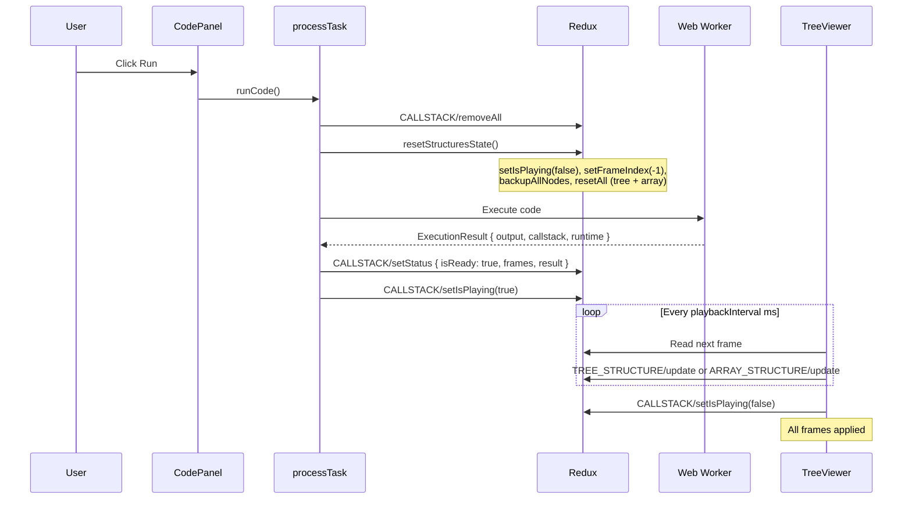
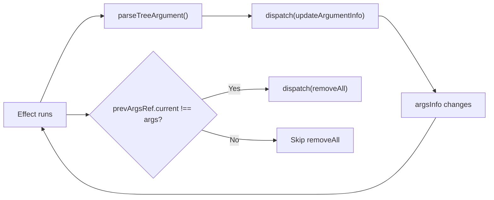
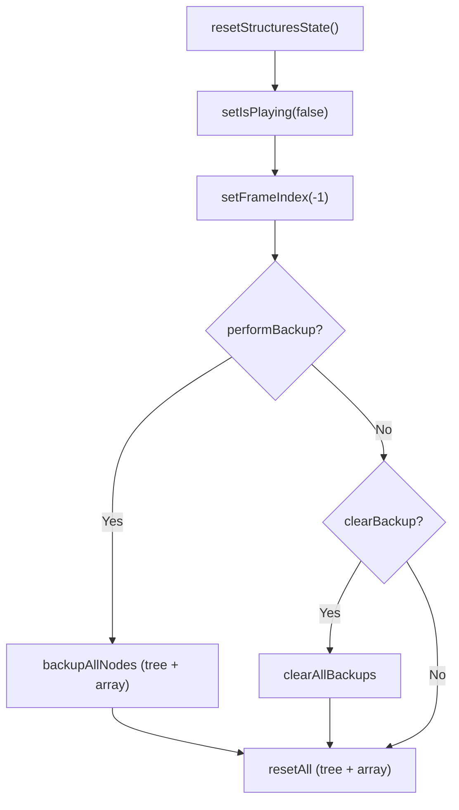
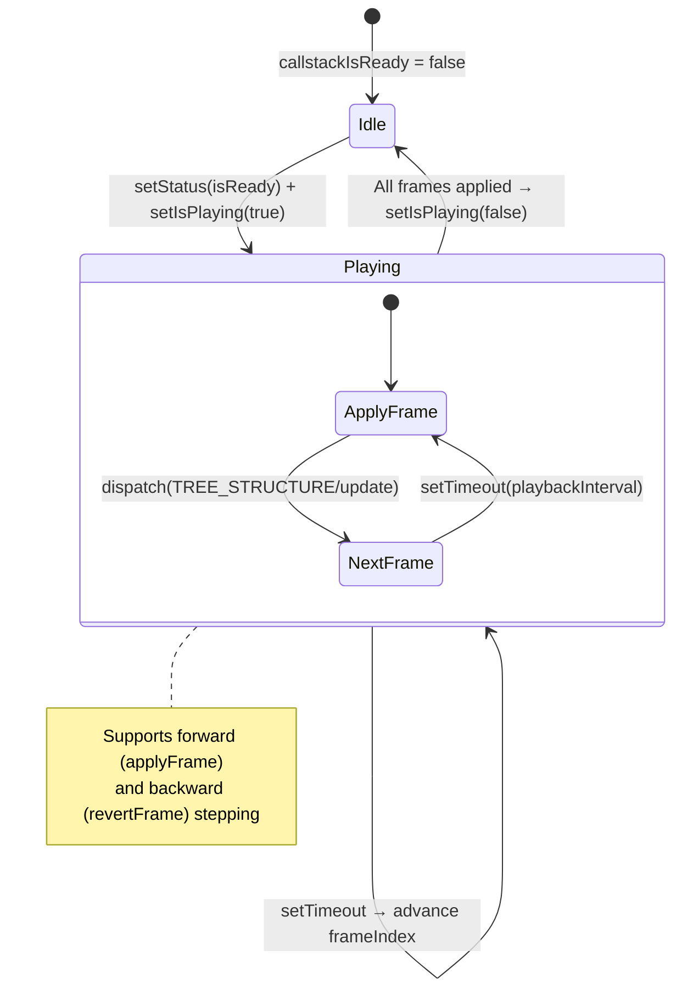

# Code Execution & State Flow

This document describes how code execution flows through the Redux state, from pressing "Run" to rendering animated results in the tree viewer.

## Redux Slices Involved

| Slice | Key State | Purpose |
|---|---|---|
| `callstackSlice` | `frames`, `isReady`, `isPlaying`, `frameIndex`, `result`, `error`, `runtime` | Execution results and animation playback state |
| `treeNodeSlice` | Per-tree node entities with positions, colors, values | Binary tree / linked list / graph visual state |
| `arrayStructureSlice` | Per-array node entities | Array / matrix visual state |
| `caseSlice` | `arguments`, `argumentsInfo` | Test case input data and metadata |

## Execution Timeline



## `callstackSlice.removeAll` — Who Calls It and Why

`CALLSTACK/removeAll` resets `isReady` to `false`, clears all frames, result, error, and runtime. It is dispatched from two places:

| Caller | When | Purpose |
|---|---|---|
| `processTask` in `useCodeExecution.ts` | Before every code execution | Clear stale results before new run |
| `useArgumentsParsing` in `useArgumentsParsing.ts` | When `args` changes (test case switch) | Old callstack frames are invalid for new args |

### Guard in `useArgumentsParsing`

The effect depends on `[args, argsInfo, dispatch]`. However, `parseTreeArgument` inside the effect dispatches `CASE/updateArgumentInfo`, which changes `argsInfo`, causing the effect to self-trigger:



Without the `prevArgsRef` guard, `removeAll` would fire on:

- Initial mount (wiping results that were just set)
- Self-triggered re-runs from `argsInfo` changes

The fix only dispatches `removeAll` when `args` actually changes (new test case selected):

```typescript
if (prevArgsRef.current !== null && prevArgsRef.current !== args) {
  dispatch(callstackSlice.actions.removeAll());
}
prevArgsRef.current = args;
```

## `resetStructuresState`

Utility that resets the visual state of tree and array structures before a new execution:

```typescript
resetStructuresState(dispatch, performBackup = true, clearBackup = false)
```



Called from:
- `processTask` — with backup (`performBackup = true`)
- `useNodesRuntimeUpdates` — without backup on replay (`performBackup = false`)

## Animation Playback (`useNodesRuntimeUpdates`)

Located in `TreeViewer`, this hook drives the step-by-step visualization:



1. Subscribes to `callstackIsReady`, `callstackIsPlaying`, `frameIndex`, and `frames` from Redux
2. When `isPlaying` is `true`, advances `frameIndex` on a timer (`playbackInterval` ms)
3. Each frame is applied via `applyFrame()` which dispatches the appropriate structure update (`setColor`, `setVal`, `addNode`, `deleteNode`, etc.)
4. Supports backward stepping via `revertFrame()`
5. Stops when all frames have been applied

## `useArgumentsParsing`

Located in `TreeViewer`, this hook initializes the visual tree/array structures from the test case arguments:

1. Reads `args` (case arguments) and `argsInfo` (metadata like node positions) from Redux
2. For each argument, calls `parseTreeArgument` or `parseArrayArgument` to dispatch tree/array initialization actions
3. Cleans up removed structures when arguments change
4. Guards `removeAll` to only fire on actual arg changes (see above)

## Key Files

| File | Purpose |
|---|---|
| `src/features/codeRunner/hooks/useCodeExecution.ts` | Orchestrates code execution, dispatches results to Redux |
| `src/features/codeRunner/hooks/useJSCodeRunner.ts` | JavaScript execution via Web Worker |
| `src/features/codeRunner/hooks/usePythonCodeRunner.ts` | Python execution via Pyodide Web Worker |
| `src/features/codeRunner/ui/CodePanel.tsx` | UI for code editing and run controls |
| `src/features/callstack/model/callstackSlice.ts` | Redux slice for execution results and playback state |
| `src/features/treeViewer/hooks/useArgumentsParsing.ts` | Parses case args into visual tree/array structures |
| `src/features/treeViewer/hooks/useNodesRuntimeUpdates.ts` | Drives frame-by-frame animation playback |
| `src/features/treeViewer/lib/resetStructuresState.ts` | Utility to reset visual structures before execution |
