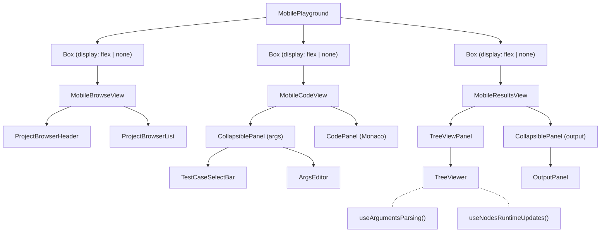
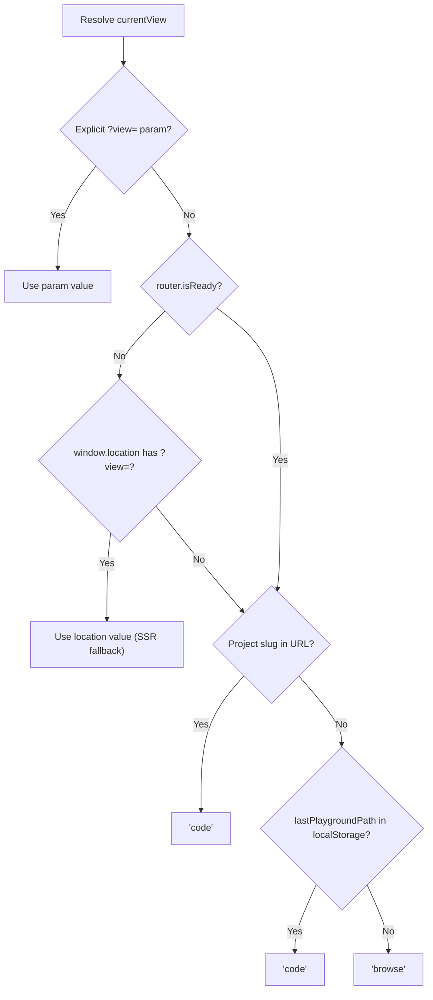
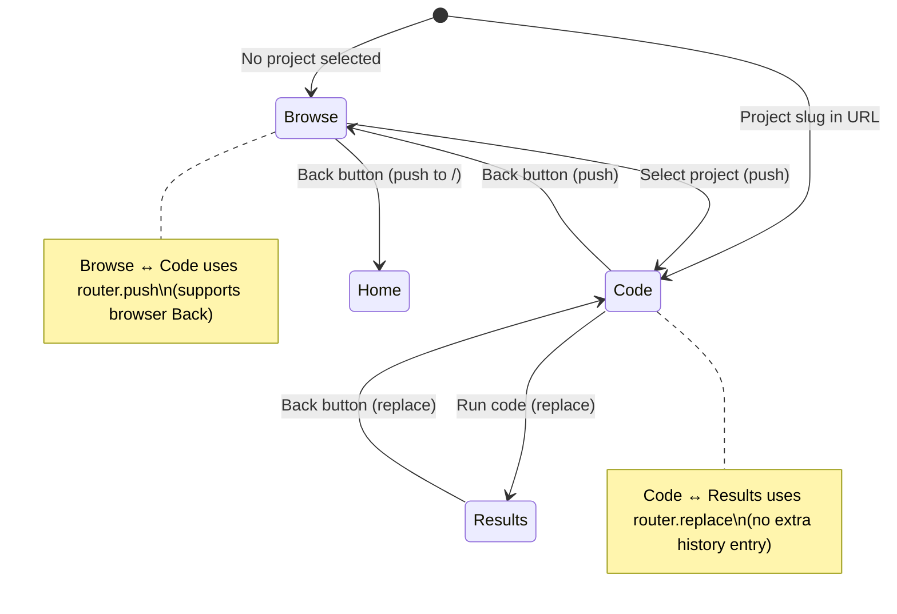

# Mobile Playground Architecture

The playground page (`src/pages/playground/[[...slug]].tsx`) renders a completely different layout on mobile vs desktop. Desktop uses a four-panel split layout (`SplitPanelsLayout`). Mobile uses a three-phase single-view design managed by `MobilePlayground`.

## Three-Phase View System

Mobile organizes the playground into three distinct phases, controlled by the `?view=` query parameter:

| Phase | `?view=` | Component | Contains |
|---|---|---|---|
| **Browse** | `browse` | `MobileBrowseView` | Project browser with search, categories, difficulty filters |
| **Code** | _(absent)_ | `MobileCodeView` | Collapsible args panel + `CodePanel` with Monaco editor |
| **Results** | `results` | `MobileResultsView` | `TreeViewPanel` (structure viewer) + collapsible `OutputPanel` |

The "code" view is the default when a project slug is present, so `?view=` is omitted to keep URLs clean.

## Keep-Alive Rendering

All three views are **always mounted** simultaneously. The active view gets `display: flex`; inactive views get `display: none`.

This is critical because:

- **No hook re-initialization.** Hooks like `useArgumentsParsing` (in `TreeViewer`) and `useCodeExecution` (in `CodePanel`) stay alive across view switches. Previously, conditional rendering caused `useArgumentsParsing` to dispatch `CALLSTACK/removeAll` on every mount, wiping execution results.
- **Web Workers persist.** The JS and Python code execution workers (initialized in `useJSCodeRunner` / `usePythonCodeRunner`) remain active, avoiding cold-start delays.
- **Playback continuity.** `useNodesRuntimeUpdates` in `TreeViewer` continues driving animation playback without restarting.

## View Resolution (`useMobilePlaygroundView`)

The hook resolves the current view in priority order:

## Navigation

- **Forward button** — disabled on Browse if no project is selected; disabled on Code if no results exist

## Toolbar (`MobilePlaygroundToolbar`)

Compact `AppBar` with:
- **Back/Forward arrows** for phase navigation
- **Current phase label** (BROWSE / CODE / RESULTS)
- **Folder icon** — quick jump to Browse from any view
- **User avatar / Sign In** — session-aware

## Layout Constraints

- No vertical scrolling on the page container (`overflow: hidden`)
- Full viewport height: `calc(100vh - 48px)` (48px = `MOBILE_APPBAR_HEIGHT`)
- Monaco editor uses `height: "100%"` on mobile (not fixed pixel height)
- Collapsible panels have max-height constraints (`35vh` for args, `40vh` for output)

## Key Files

| File | Purpose |
|---|---|
| `src/pages/playground/[[...slug]].tsx` | Page component; renders `MobilePlayground` or `DesktopWrapper` |
| `src/features/playground/ui/MobilePlayground.tsx` | Keep-alive container for all three mobile views |
| `src/features/playground/hooks/useMobilePlaygroundView.ts` | View state management via `?view=` query param |
| `src/features/playground/ui/MobileBrowseView.tsx` | Project browser with search/filter/pagination |
| `src/features/playground/ui/MobileCodeView.tsx` | Args panel + code editor |
| `src/features/playground/ui/MobileResultsView.tsx` | Tree viewer + output panel |
| `src/features/playground/ui/CollapsiblePanel.tsx` | Reusable collapsible section with header |
| `src/features/appBar/ui/MobilePlaygroundToolbar.tsx` | Mobile-specific toolbar with phase navigation |

## Entry Points from Home Page

| Button | Destination | Behavior |
|---|---|---|
| "Try It Out" | `/playground/invert-binary-tree` | Opens a specific demo problem in Code view |
| "Browse Projects" | `/playground?view=browse` | Opens the project browser |
