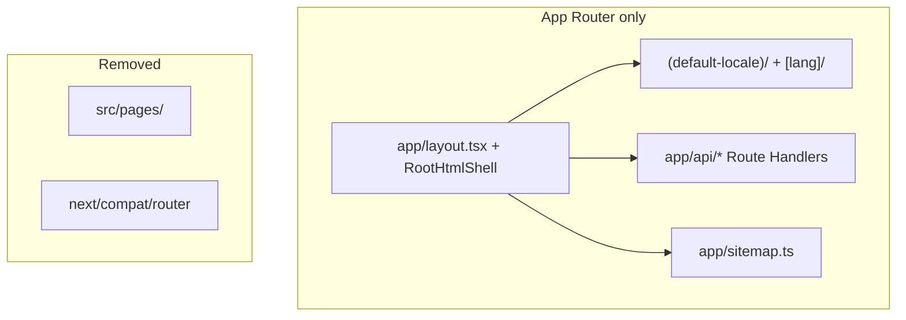

# App Router — full migration plan

## Status (2026-09)

**User-facing UI is fully on App Router.** Locale migration (L1–L5) and Instant Nav adoption on marketing + playground are **complete**.

What remains is **Pages Router infrastructure**: API routes, sitemap, and the legacy `_app` / `_document` shell. Finishing that work removes dual-router bridges and lets us delete `src/pages/` entirely.

| Layer | Router | Status |
|-------|--------|--------|
| `/`, `/privacy`, `/daily`, `/playground`, `/profile/*` | App `(default-locale)/` + `[lang]/` | **Done** |
| `/{locale}/*` (non-default) | App `[lang]/` | **Done** |
| Locale config (`next.config` `i18n`) | Removed (L2) | **Done** |
| Instant Nav / Cache Components (L5) | App routes | **Done** |
| `/api/*` | Pages API | **Interim** |
| `/sitemap.xml` | Pages `getServerSideProps` | **Interim** |
| `_app.tsx`, `_document.tsx` | Pages shell | **Vestigial** (no UI pages) |

---

## Goal

**100% App Router repo** — no `src/pages/` tree, no `next/compat/router`, single navigation and provider story.

Public URLs, SEO, auth, tRPC, and preview smoke must stay unchanged at each step.

---

## What stays on Pages today

```
src/pages/
├── api/auth/[...nextauth].ts      # NextAuth
├── api/trpc/[trpc].ts             # tRPC (createNextApiHandler)
├── api/graphql.ts                 # LeetCode GraphQL proxy
├── api/upload-url.ts              # S3 presigned POST
├── api/ext/checkDailyProblem.ts   # Extension helper
├── sitemap.xml.ts                 # Dynamic sitemap (DB)
├── _app.tsx                       # Provider shell (unused by UI routes)
└── _document.tsx                  # Fonts + Material Icons (App uses RootHtmlShell)
```

**Note:** API handlers do not render `_app`, but Next.js still ships the Pages Router runtime while any file exists under `pages/`.

---

## Remaining work — phased

### P6 — Sitemap → App Router (low risk)

**Scope:** Move `pages/sitemap.xml.ts` → `app/sitemap.ts` ([MetadataRoute.Sitemap](https://nextjs.org/docs/app/api-reference/file-conventions/metadata/sitemap)).

**Keep:** Same DB query, URL list, XML escaping, `lastmod` format.

**Do not:** Change sitemap URL paths or drop public playground slugs.

| Gate | Check |
|------|--------|
| Output parity | Diff `/sitemap.xml` before/after (local + preview) |
| SEO | All indexable App routes still listed |
| CI | `pnpm lint`, `pnpm test:ci` |

**Deletes:** `src/pages/sitemap.xml.ts`

---

### P7 — API Route Handlers (incremental, medium risk)

Migrate **`pages/api/*` → `app/api/*/route.ts`** one endpoint at a time. Pages and App Route Handlers can coexist during cutover; prefer **copy → verify → delete** per route.

Recommended order (simplest → most coupled):

| # | Route | App path | Notes |
|---|-------|----------|--------|
| 1 | `upload-url` | `app/api/upload-url/route.ts` | Query params → `request.nextUrl.searchParams` |
| 2 | `ext/checkDailyProblem` | `app/api/ext/checkDailyProblem/route.ts` | POST body + `cookies()` from `next/headers` |
| 3 | `graphql` | `app/api/graphql/route.ts` | Proxy; preserve cookie forwarding |
| 4 | `trpc/[trpc]` | `app/api/trpc/[trpc]/route.ts` | `fetchRequestHandler` from `@trpc/server/adapters/fetch`; reuse `createTRPCContext` |
| 5 | `auth/[...nextauth]` | `app/api/auth/[...nextauth]/route.ts` | NextAuth v4 App Router export pattern; keep `authOptions` |

**tRPC client:** Confirm `TrpcProvider` / `httpBatchLink` URL stays `/api/trpc` (no client change if path unchanged).

**NextAuth:** `getServerSession(authOptions)` in RSC already works; Pages-only `get-server-auth-session.ts` wrapper can move to Route Handler / RSC helpers after cutover.

| Gate | Check |
|------|--------|
| API routing | `PLAYWRIGHT_EXPECT_MATCHED_PATH=true pnpm preview-smoke` |
| Auth | Sign-in flow + `getServerSession` in App layouts |
| App data | Playground project load (tRPC), profile (GraphQL if used) |
| CI | Full Vercel preview e2e |

**Deletes (when all five migrated):** entire `src/pages/api/` tree.

---

### P8 — Retire Pages shell

**Prerequisites:** P6 + P7 complete (nothing left under `src/pages/` except `_app` / `_document`).

**Scope:**

1. Delete `src/pages/_app.tsx` and `src/pages/_document.tsx`.
2. Delete empty `src/pages/` directory.
3. Remove Pages-only dead code:
   - `src/i18n/getI18nProps.ts` helpers used only by deleted Pages routes (keep tests or migrate to App metadata helpers).
   - `get-server-auth-session.ts` Pages `GetServerSidePropsContext` wrapper if unused.
4. Confirm `next build` no longer emits a **Pages** route table (only App + Proxy).

| Gate | Check |
|------|--------|
| Build | `next build` — no Pages routes |
| Fonts | Inter / Space Grotesk still load (`RootHtmlShell` + `appFonts` import in root layout) |
| CI | preview smoke + e2e |

---

### P9 — App-native navigation (cleanup)

Remove dual-router bridges now that all UI is App-only:

| File | Change |
|------|--------|
| `usePagesRouterCompat.ts` | Delete; use `next/navigation` |
| `useRoutePathname.ts` | `usePathname()` only |
| `useSearchParam.ts` | `useSearchParams()` from `next/navigation` |
| `usePlaygroundRoute.ts`, `useProfileUserId.ts` | Drop compat fallbacks |
| Feature hooks / tests | Update mocks from `next/compat/router` → `next/navigation` |

| Gate | Check |
|------|--------|
| Unit | Hook tests + MainAppBar tests |
| E2e | Playground nav, profile, instant marketing |

---

### P10 — Optional hardening (post-100% App)

Not required to delete `pages/`, but improves maintainability:

- **`generateStaticParams` for `[lang]`** — explicit locale static params (today relies on PPR + proxy).
- **Dedupe route trees** — `(default-locale)/` vs `[lang]/` share page modules (already mostly true); consider single `[lang]` with `baseLocale` rewrite only if bundle/size warrants it.
- **Profile `instant = true`** — Suspense around user-specific blocks (session already client-fetched).
- **Stream SSR session into `SessionProvider`** — optional; avoids signed-in app bar flash without blocking cached locale layout.
- **Remove `EmotionCacheProvider` from Pages patterns** — App uses `AppRouterCacheProvider` only.
- **Update stale docs** — keep `Instant-Navigations-Design.md` routing map in sync (see References).

---

## Architecture (target)



---

## Testing gates (every phase)

| Gate | Command |
|------|---------|
| Lint + types | `pnpm lint` |
| Unit + Python harness | `pnpm test:ci` |
| Preview API paths | `PLAYWRIGHT_EXPECT_MATCHED_PATH=true pnpm preview-smoke` |
| E2e | Vercel preview CI (`pnpm test:e2e` locally) |
| Instant Nav regressions | Marketing + playground `instant()` specs |

---

## Risks

| Risk | Mitigation |
|------|------------|
| tRPC context differs on fetch adapter | Reuse `createTRPCContext`; test all playground mutations/queries on preview |
| NextAuth cookie/session path change | Keep `/api/auth/*` path identical; test OAuth + credentials |
| Sitemap URL drift | Byte-compare sitemap before/after P6 |
| Removing compat router too early | Only in P9 after P8; run full e2e |
| Vercel `x-matched-path` on `/api/*` | Same preview-smoke gate used for 16.3 upgrade |

---

## Suggested PR order

1. **P6** — sitemap only (small, isolated).
2. **P7a** — `upload-url` + `checkDailyProblem` (low traffic).
3. **P7b** — `graphql` proxy.
4. **P7c** — tRPC fetch handler (highest traffic — own PR).
5. **P7d** — NextAuth Route Handler (own PR, auth-sensitive).
6. **P8** — delete Pages shell + dead i18n Pages helpers.
7. **P9** — compat router removal.
8. **P10** — as needed; no blocking dependency.

---

## References

- `vibe-docs/Locale-Migration-Design.md` — L1–L5 (complete)
- `vibe-docs/Instant-Navigations-TODO.md` — Instant Nav phases (complete)
- `src/app/` — all public UI routes
- `src/proxy.ts` — locale + device headers for App Router
- Next.js Route Handlers: `node_modules/next/dist/docs/01-app/03-api-reference/03-file-conventions/route.md`
- tRPC fetch adapter: `node_modules/@trpc/server/skills/adapter-fetch/SKILL.md`
