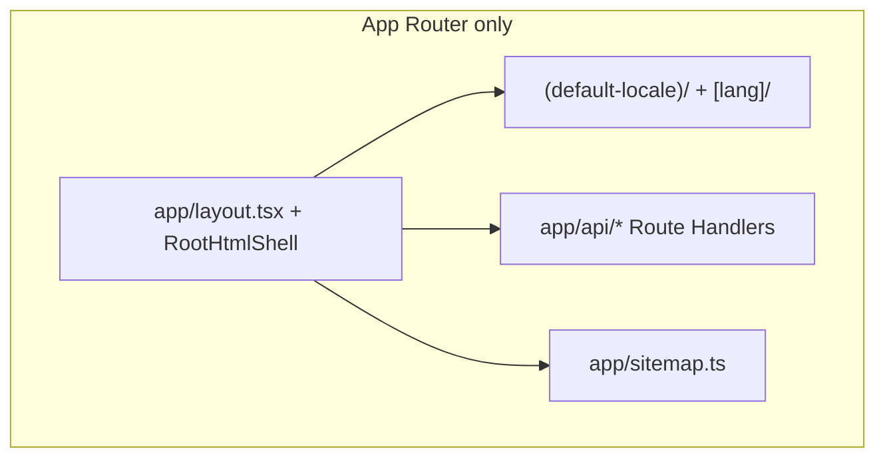

# App Router — full migration plan

## Status (2026-09)

**Migration complete.** User-facing UI, API routes, and sitemap are on **App Router**. Locale migration (L1–L5), Instant Nav adoption, and Pages Router teardown (P6–P9) are **done**.

| Layer | Router | Status |
|-------|--------|--------|
| `/`, `/privacy`, `/daily`, `/playground`, `/profile/*` | App `(default-locale)/` + `[lang]/` | **Done** |
| `/{locale}/*` (non-default) | App `[lang]/` | **Done** |
| Locale config (`next.config` `i18n`) | Removed (L2) | **Done** |
| Instant Nav / Cache Components (L5) | App routes | **Done** |
| `/api/*` | App Route Handlers (`app/api/*/route.ts`) | **Done** (P7) |
| `/sitemap.xml` | `app/sitemap.ts` | **Done** (P6) |
| `next/compat/router` bridges | Removed | **Done** (P9) |
| `src/pages/` | Deleted | **Done** (P8) |

**Remaining:** none — P10 optional follow-ups complete.

---

## Goal (achieved)

**100% App Router repo** — no `src/pages/` tree, no `next/compat/router`, single navigation and provider story.

Public URLs, SEO, auth, tRPC, and preview smoke unchanged through P6–P9 cutover.

---

## Completed phases (P6–P9)

### P6 — Sitemap → App Router

Moved `pages/sitemap.xml.ts` → `app/sitemap.ts`. Same DB query, URL list, and SEO coverage.

### P7 — API Route Handlers

Migrated all `pages/api/*` → `app/api/*/route.ts`:

| Route | App path |
|-------|----------|
| `upload-url` | `app/api/upload-url/route.ts` |
| `ext/checkDailyProblem` | `app/api/ext/checkDailyProblem/route.ts` |
| `graphql` | `app/api/graphql/route.ts` |
| `trpc/[trpc]` | `app/api/trpc/[trpc]/route.ts` |
| `auth/[...nextauth]` | `app/api/auth/[...nextauth]/route.ts` |

tRPC uses `fetchRequestHandler`; NextAuth v4 App Router export pattern; `authOptions` shared from `src/server/auth/authOptions.ts`.

### P8 — Retire Pages shell

Deleted `src/pages/_app.tsx`, `_document.tsx`, and the entire `pages/` tree. Removed Pages-only helpers (`get-server-auth-session.ts`, Pages tRPC session wrapper).

### P9 — App-native navigation

Removed `usePagesRouterCompat` and compat fallbacks. Hooks use `next/navigation` only: `useRoutePathname`, `useSearchParam`, `usePlaygroundRoute`, `useProfileUserId`. Single App-only `I18nProvider`.

---

## P10 — Optional hardening (post-100% App)

| Item | Status |
|------|--------|
| **`generateStaticParams` for `[lang]`** | **Done** — `generateLangStaticParams()` (non-`en` locales; `en` uses `(default-locale)/`) |
| **Profile `instant = true`** | **Done** — Suspense + `ProfilePageSkeleton`; `e2e/instant-profile-nav.spec.ts` |
| **SSR device hint on first paint** | **Done** — PR #184 (`LocaleAppLayout` reads proxy header synchronously) |
| **Update stale docs** | **Done** — this plan + Instant Nav design/TODO |
| **Dedupe route trees** | **Done** — shared `locale-app/pages/*` modules; route files re-export |
| **Stream SSR session into `SessionProvider`** | **Done** — `ServerSessionBoundary` + `SessionGate` in Suspense (mounts provider with server session; next-auth v4 safe) |

---

## Architecture (current)

---

## Testing gates (every phase)

| Gate | Command |
|------|---------|
| Lint + types | `pnpm lint` |
| Unit + Python harness | `pnpm test:ci` |
| Preview API paths | `PLAYWRIGHT_EXPECT_MATCHED_PATH=true pnpm preview-smoke` |
| E2e | Vercel preview CI (`pnpm test:e2e` locally) |
| Instant Nav regressions | Marketing + playground `instant()` specs |

---

## References

- `vibe-docs/Locale-Migration-Design.md` — L1–L5 (complete)
- `vibe-docs/Instant-Navigations-TODO.md` — Instant Nav + P6–P10 checklist
- `src/app/` — all public UI routes
- `src/proxy.ts` — locale + device headers for App Router
- Next.js Route Handlers: `node_modules/next/dist/docs/01-app/03-api-reference/03-file-conventions/route.md`
