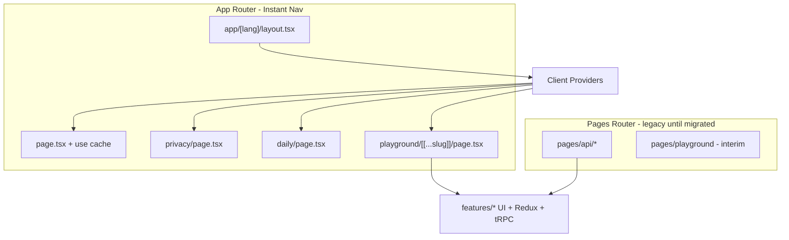

# Next.js 16.3 Instant Navigations — Design

## Executive summary

**Instant Navigations** (Cache Components, Partial Prefetching, Instant Insights, Navigation Inspector, Playwright `instant()`) is an **App Router–only** opt-in feature set.

**Current state (2026-09):** All **user-facing routes** live on **App Router** (`src/app/(default-locale)/`, `src/app/[lang]/`). **`cacheComponents` + `partialPrefetching`** are enabled; marketing and playground pages export `instant = true` where validated. **Pages Router remains only for** `/api/*`, `/sitemap.xml`, and vestigial `_app` / `_document` — see **`vibe-docs/App-Router-Migration-Plan.md`** for the finish line.

**Overall difficulty:** Locale + Instant Nav pilot — **done**. Remaining full-App migration (API + sitemap + compat cleanup) — **4/10** (incremental, well-bounded).

| Track | What you get | Status |
|-------|----------------|--------|
| **A. Agent-native DX** | Bundled docs in `AGENTS.md` | Done |
| **B. 16.3 platform** | Build cache, prefetch inlining | On `next@16.3.2`; preview smoke green |
| **C. Instant Navigations** | PPR shells, `instant()`, e2e | Done on App marketing + playground |
| **D. Full App Router** | Delete `src/pages/`, drop compat router | **P6–P9** in App-Router-Migration-Plan |

---

## What Instant Navigations is (16.3)

Enable in `next.config`:

```ts
const nextConfig = {
  cacheComponents: true,
  partialPrefetching: true,
  experimental: {
    instantNavigationDevToolsToggle: true, // Instant Insights + Navigation Inspector
  },
};
```

Per-route validation:

```tsx
export const unstable_instant = { prefetch: 'static' };
```

Patterns:

- Wrap runtime/dynamic data in `<Suspense>` with explicit fallbacks (loading shells).
- Mark stable data with `'use cache'` + `cacheLife`.
- Use `@next/playwright` `instant()` for regression tests.

**Bundled docs (read before coding):**

- `node_modules/next/dist/docs/01-app/02-guides/instant-navigation.md`
- `node_modules/next/dist/docs/01-app/02-guides/migrating-to-cache-components.md`
- `node_modules/next/dist/docs/01-app/02-guides/adopting-partial-prefetching.md` (if present)
- Blog: [Next.js 16.3 — Instant Navigations](https://nextjs.org/blog/next-16-3-instant-navigations)

---

## Current dStruct routing map

| Route | Router | Data / notes |
|-------|--------|----------------|
| `/`, `/privacy`, `/daily` | App `(default-locale)/` + `[lang]/` | Cached i18n; `instant = true` |
| `/playground/[[...slug]]` | App | Client-heavy; `instant = true` + Suspense skeleton |
| `/profile/[userId]` | App | Client view; `instant = false` |
| `/api/*` | **Pages API** (interim) | tRPC, NextAuth, GraphQL proxy, upload, extension |
| `/sitemap.xml` | **Pages** (interim) | DB-backed; migrate to `app/sitemap.ts` (P6) |

**Provider tree (App):** `AppRouterCacheProvider` → `AppShellProviders` → `AppRouterI18nProvider` → page views. Pages `_app.tsx` is vestigial once API routes migrate.

---

## i18n (resolved)

Pages `i18n` in `next.config.mjs` was **removed in L2**. Locales are **`app/[lang]/`** + **`(default-locale)/`** with `proxy.ts` setting `APP_ROUTER_LOCALE_HEADER`. typesafe-i18n: server `loadI18nForLocale` (`'use cache'`) + client `AppRouterI18nProvider`.

---

## Vercel / 16.3 upgrade gate

On branch `cursor/update-nextjs-react-8f0a`, **Next.js 16.3.0** caused preview 404s for `/api/trpc/*` and `/api/auth/session` (`x-matched-path: /en/404`). **16.2.12** restored API routing.

Before enabling `cacheComponents` in production:

1. Bump to **latest 16.3.x** (not 16.3.0 only).
2. Verify preview headers: `x-matched-path: /api/trpc/[trpc]`, not `/en/404`.
3. Confirm [adapter-vercel i18n API fix](https://github.com/nextjs/adapter-vercel/pull/81) is in the release you ship.

Webpack production build is **not** a viable workaround today (`sanitize-html` / `htmlparser2` ESM under `import-esm-externals`).

---

## Recommended phases

### Phase 0 — Agent-native DX (now, no router change)

- [x] `AGENTS.md` with bundled-docs block (16.2+).
- [ ] `CLAUDE.md` → `@AGENTS.md`.
- [ ] Extend `AGENTS.md` with Instant Nav / Cache Components doc paths and **“dStruct is Pages Router until Phase 1”** guardrail.
- [ ] Optional: [Next.js DevTools MCP](https://github.com/vercel/next-devtools-mcp) in `.mcp.json` for upgrade/migration prompts.

**No user-visible nav change.**

### Phase 1 — Re-upgrade to 16.3.x + verify Vercel

- Bump `next` to latest 16.3.x on `cursor/update-nextjs-react-8f0a` (or follow-up branch).
- Smoke-test preview API routes and playground.
- Ship general 16.3 wins (memory, build cache, prefetch inlining) **without** `cacheComponents`.

### Phase 2 — App Router pilot (marketing + i18n segment)

Scope: **home, privacy, daily** under `src/app/[lang]/`.

1. Add `src/app/[lang]/layout.tsx` with shared `Providers` (extract from `_app.tsx`).
2. Port static marketing pages; map `getI18nPropsWithCanonical` → Server Component + `lang()` from `next/root-params`.
3. Keep `src/pages/playground`, `profile`, APIs on Pages Router (coexistence supported).
4. Enable `cacheComponents: true` **only after** first App routes build clean in dev (expect Cache Components errors guiding Suspense/`use cache` fixes).
5. Add `unstable_instant` on pilot routes; turn on `instantNavigationDevToolsToggle` in dev.

**Success:** Instant Insights shows green navigations between `/en`, `/en/privacy`, `/en/daily`; Pages playground still works.

### Phase 3 — Playground shell (optional, high effort)

- Introduce `app/[lang]/playground/[[...slug]]/page.tsx` that renders a **thin Server shell** (app bar, SEO) + existing client `Playground` feature module inside `<Suspense>`.
- tRPC/Redux stay client-side; cache only static chrome and project list skeletons where safe.
- Revisit URL state / project browser integration with App Router navigation.

### Phase 4 — Profile, sitemap, deprecate Pages

- Migrate `profile/[userId]`, `sitemap.xml`.
- Remove `i18n` from `next.config.mjs` when no Pages user routes remain.
- Add Playwright `instant()` tests for marketing navigations.

---

## Architecture (target end state)



---

## Risks

| Risk | Mitigation |
|------|------------|
| Vercel i18n API regression on 16.3 | Gate on preview smoke tests; stay on 16.2.12 until green |
| Duplicate providers / hydration mismatch | Single `Providers.tsx`; match `_app` order; test Emotion cache |
| typesafe-i18n in Server Components | Keep client `I18nProvider` for interactive UI; pass `LL` or use server-side locale loaders consistently |
| tRPC `api.withTRPC` is Pages-oriented | Use existing `api` hooks in client components; add RSC tRPC only if needed later |
| SEO / canonical URLs | Preserve `getI18nPropsWithCanonical` behavior in App metadata API |
| Build time × 20 locales | `generateStaticParams` for `[lang]`; cache aggressively with `'use cache'` |

---

## What we are **not** doing in Phase 0–1

- Enabling `cacheComponents` on Pages Router (unsupported).
- Removing Pages `i18n` before App `[lang]` routes exist.
- Rewriting playground data layer to Server Components.

---

## Heavy client lifecycle (Activity / `cacheComponents`)

Visited routes can stay mounted in hidden Activity boundaries. Heavy clients must **defer mount one frame**, **dispose on hide/unmount**, and **clear parent refs** so show cycles recreate cleanly.

| Runtime | Shell / hook | Route |
|---------|----------------|-------|
| R3F WebGL | `WebGLCanvasShell` + `useDeferredClientMount` | Home (`instant=true`) |
| Monaco | `CodeRunner` shell + `onEditorUnmount` | Playground |
| Pyodide worker | `pythonRunner.release()` via `usePlaygroundRuntimeRelease` | Playground |
| Shared primitive | `useDeferredClientMount(onCleanup?)` | Reuse for future widgets |

Hard navigation (L5): production PPR shell validated by `instant-marketing-hard-nav` e2e (skips under `next dev`); `RootHtmlShell` sets `lang`/`dir` from the proxy locale header.

---

## References

- [Next.js 16.3 blog](https://nextjs.org/blog/next-16-3)
- [Instant Navigations blog](https://nextjs.org/blog/next-16-3-instant-navigations)
- [AI agents guide](https://nextjs.org/docs/app/guides/ai-agents) → `node_modules/next/dist/docs/01-app/02-guides/ai-agents.md`
- PR #160 — dependency upgrade branch (Next pin history)
