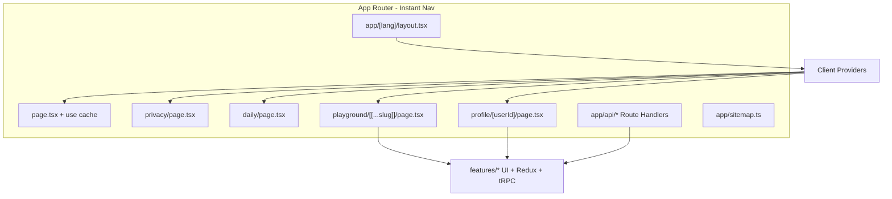

# Next.js 16.3 Instant Navigations — Design

## Executive summary

**Instant Navigations** (Cache Components, Partial Prefetching, Instant Insights, Navigation Inspector, Playwright `instant()`) is an **App Router–only** opt-in feature set.

**Current state (2026-09):** All routes are on **App Router** (`src/app/`). **`cacheComponents` + `partialPrefetching`** are enabled; marketing, playground, and profile pages export `instant = true` where validated. **Pages Router is fully retired** (P6–P9) — see **`vibe-docs/App-Router-Migration-Plan.md`**.

**Overall difficulty:** Locale + Instant Nav + full App migration — **done**. P10 polish (route dedupe, SSR session stream) — **done**.

| Track | What you get | Status |
|-------|----------------|--------|
| **A. Agent-native DX** | Bundled docs in `AGENTS.md` | Done |
| **B. 16.3 platform** | Build cache, prefetch inlining | On `next@16.3.2`; preview smoke green |
| **C. Instant Navigations** | PPR shells, `instant()`, e2e | Done on App marketing + playground |
| **D. Full App Router** | Delete `src/pages/`, drop compat router | **Done** (P6–P9) |

---

## What Instant Navigations is (16.3)

Enable in `next.config`:

```ts
const nextConfig = {
  cacheComponents: true,
  partialPrefetching: true,
  experimental: {
    instantNavigationDevToolsToggle: true, // Instant Insights + Navigation Inspector
  },
};
```

Per-route validation:

```tsx
export const unstable_instant = { prefetch: 'static' };
```

Patterns:

- Wrap runtime/dynamic data in `<Suspense>` with explicit fallbacks (loading shells).
- Mark stable data with `'use cache'` + `cacheLife`.
- Use `@next/playwright` `instant()` for regression tests.

**Bundled docs (read before coding):**

- `node_modules/next/dist/docs/01-app/02-guides/instant-navigation.md`
- `node_modules/next/dist/docs/01-app/02-guides/migrating-to-cache-components.md`
- `node_modules/next/dist/docs/01-app/02-guides/adopting-partial-prefetching.md` (if present)
- Blog: [Next.js 16.3 — Instant Navigations](https://nextjs.org/blog/next-16-3-instant-navigations)

---

## Current dStruct routing map

| Route | Router | Data / notes |
|-------|--------|----------------|
| `/`, `/privacy`, `/daily` | App `(default-locale)/` + `[lang]/` | Cached i18n; `instant = true` |
| `/playground/[[...slug]]` | App | Client-heavy; `instant = true` + Suspense skeleton |
| `/profile/[userId]` | App | Client view; `instant = true` + Suspense skeleton (P10) |
| `/api/*` | App Route Handlers | tRPC, NextAuth, GraphQL proxy, upload, extension (P7) |
| `/sitemap.xml` | `app/sitemap.ts` | DB-backed (P6) |

**Provider tree (App):** `AppRouterCacheProvider` → `RuntimeDeviceHintProvider` → `AppShellProviders` → `I18nProvider` → `SessionGate` (via `ServerSessionBoundary` Suspense) → page views.

---

## i18n (resolved)

Pages `i18n` in `next.config.mjs` was **removed in L2**. Locales are **`app/[lang]/`** + **`(default-locale)/`** with `proxy.ts` setting `APP_ROUTER_LOCALE_HEADER`. typesafe-i18n: server `loadI18nForLocale` (`'use cache'`) + client `I18nProvider`.

---

## Vercel / 16.3 upgrade gate

On branch `cursor/update-nextjs-react-8f0a`, **Next.js 16.3.0** caused preview 404s for `/api/trpc/*` and `/api/auth/session` (`x-matched-path: /en/404`). **16.2.12** restored API routing.

Before enabling `cacheComponents` in production:

1. Bump to **latest 16.3.x** (not 16.3.0 only).
2. Verify preview headers: `x-matched-path: /api/trpc/[trpc]`, not `/en/404`.
3. Confirm [adapter-vercel i18n API fix](https://github.com/nextjs/adapter-vercel/pull/81) is in the release you ship.

Webpack production build is **not** a viable workaround today (`sanitize-html` / `htmlparser2` ESM under `import-esm-externals`).

---

## Completed migration (Phases 0–4 + P6–P10)

All items below are **done** — kept as historical context. See **`vibe-docs/Instant-Navigations-TODO.md`** for the checklist.

### Phase 0 — Agent-native DX

- [x] `AGENTS.md` with bundled-docs block
- [x] `CLAUDE.md` → `@AGENTS.md`
- [x] Instant Nav / Cache Components doc paths in `AGENTS.md` (App Router guardrails)
- [x] Optional `.mcp.json` for Next.js DevTools MCP

### Phase 1 — 16.3.x on Vercel

- [x] `next@16.3.2`; preview smoke + e2e green (`PLAYWRIGHT_EXPECT_MATCHED_PATH`)

### Phase 2 — App Router locale shell

- [x] `app/[lang]/` + `(default-locale)/` for marketing routes
- [x] `proxy.ts` locale header; `loadI18nForLocale` with `'use cache'`
- [x] `cacheComponents` + `partialPrefetching` enabled

### Phase 3 — Playground + profile on App Router

- [x] `app/.../playground/[[...slug]]` with `instant = true` + Suspense skeleton
- [x] `app/.../profile/[userId]` with `instant = true` + Suspense skeleton (P10)
- [x] Activity lifecycle shells (Monaco, WebGL, Pyodide)

### Phase 4 — Full App Router (P6–P10)

- [x] API Route Handlers, `app/sitemap.ts`, delete `src/pages/`, drop compat router
- [x] P10: `generateStaticParams`, SSR device hint, route dedupe, SSR session stream

**Success criteria met:** Instant Insights green on marketing/playground navigations; no Pages Router tree; preview API routes match correctly.

---

## Architecture (current)



---

## Risks

| Risk | Mitigation |
|------|------------|
| Vercel i18n API regression on 16.3 | Gate on preview smoke tests; stay on 16.2.12 until green |
| Duplicate providers / hydration mismatch | Single `AppRootLayoutClient` + `AppShellProviders`; `SessionGate` in Suspense |
| typesafe-i18n in Server Components | Server `loadI18nForLocale` (`'use cache'`) + client `I18nProvider` |
| tRPC Pages `api.withTRPC` | `TrpcProvider` in App shell (client hooks only) |
| SEO / canonical URLs | `publicPageMetadataFromTranslation` + `publicAppMetadata` in App routes |
| Build time × 20 locales | `generateStaticParams` for `[lang]`; cache aggressively with `'use cache'` |

---

## Historical constraints (resolved)

- ~~Enabling `cacheComponents` on Pages Router~~ — Pages Router retired (P8).
- ~~Removing Pages `i18n` before App `[lang]` routes~~ — L2 complete.
- Playground data layer remains client-heavy by design (Suspense shells + Activity lifecycle).

---

## Heavy client lifecycle (Activity / `cacheComponents`)

Visited routes can stay mounted in hidden Activity boundaries. Heavy clients must **defer mount one frame**, **dispose on hide/unmount**, and **clear parent refs** so show cycles recreate cleanly.

| Runtime | Shell / hook | Route |
|---------|----------------|-------|
| R3F WebGL | `WebGLCanvasShell` + `useDeferredClientMount` | Home (`instant=true`) |
| Monaco | `CodeRunner` shell + `onEditorUnmount` | Playground |
| Pyodide worker | `pythonRunner.release()` via `usePlaygroundRuntimeRelease` | Playground |
| Shared primitive | `useDeferredClientMount(onCleanup?)` | Reuse for future widgets |

Hard navigation (L5): production PPR shell validated by `instant-marketing-hard-nav` e2e (skips under `next dev`); `RootHtmlShell` sets `lang`/`dir` from the proxy locale header.

---

## References

- [Next.js 16.3 blog](https://nextjs.org/blog/next-16-3)
- [Instant Navigations blog](https://nextjs.org/blog/next-16-3-instant-navigations)
- [AI agents guide](https://nextjs.org/docs/app/guides/ai-agents) → `node_modules/next/dist/docs/01-app/02-guides/ai-agents.md`
- PR #160 — dependency upgrade branch (Next pin history)
