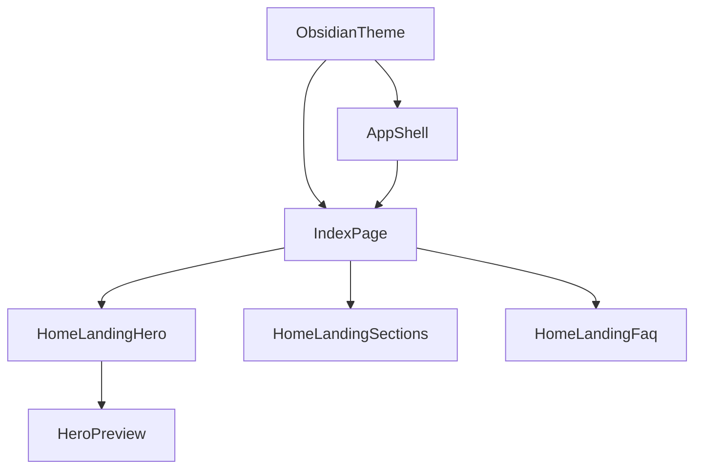

# Obsidian Home Rollout Design

## Executive Summary

This document covers a focused rollout of the Obsidian Monolith design system across the shared dark theme, core app shell surfaces, and the marketing home page.

**Overall Implementation Difficulty: 7/10** (Hard)

The rollout is intentionally limited to:

- global dark-theme foundation
- app shell and shared surface primitives
- home page redesign

It explicitly does not attempt a full product-wide restyle in one pass.

## Source Of Truth

- Stitch desktop landing: `projects/15702891587373846228/screens/2eaaf8d5102c4234889ea7f3243fafe6`
- Stitch mobile landing: `projects/15702891587373846228/screens/9e898179bac54d6092777b4bb26d7533`
- Manual design-system export: `C:\Users\maxim\Downloads\DESIGN.md`

## Current State

- `src/themes.ts` still uses a generic dark palette with bright default primary and secondary colors.
- `src/features/appBar/ui/MainAppBar.tsx` relies on primary-tinted glass and a visible bottom border.
- `src/pages/index.tsx` still uses a gradient + clipped hero with the 3D logo as the main focal element.
- The landing sections and FAQ already exist, but they follow the older visual language.

## Target State

### Theme

- Dark-first Obsidian palette
- Tonal surface hierarchy instead of explicit divider-heavy grouping
- 4px architectural rounding
- Space Grotesk for display-style statements, Inter for dense product UI
- Ghost borders only where affordance or accessibility requires them

### App Shell

- App bar, drawers, and shared surfaces feel like smoked glass on dark tonal layers
- Navigation remains functionally unchanged
- Existing components continue using MUI, but inherit new theme defaults

### Home Page

- Product-first hero with coded preview
- Subtle vibrant gradients inspired by the mobile Stitch version
- Existing 3D logo reused as a quiet atmospheric background accent
- Existing CTAs, demo links, and FAQ anchor preserved

## Architecture

## Implementation Phases

### Phase 1. Theme Foundation

Files:

- `src/themes.ts`
- `src/shared/ui/providers/StateThemeProvider.tsx`

Tasks:

- Replace current palette values with Obsidian tokens
- Add reusable tonal-surface tokens
- Add typography and component overrides
- Keep current provider flow stable

### Phase 2. App Shell Alignment

Files:

- `src/features/appBar/ui/MainAppBar.tsx`
- shared overlays and drawers as needed

Tasks:

- Update app bar glass treatment
- Reduce visible border emphasis
- Align buttons and hover states with Obsidian rules

### Phase 3. Landing Hero Rewrite

Files:

- `src/pages/index.tsx`
- new landing hero components under `src/features/homePage/ui/landing/`
- `src/shared/ui/molecules/LogoModelView.tsx`

Tasks:

- Replace the current hero composition
- Move the 3D logo into a subdued background role
- Build a coded hero preview using existing i18n strings where possible

### Phase 4. Landing Sections And FAQ

Files:

- `src/features/homePage/ui/landing/HomeLandingSections.tsx`
- `src/features/homePage/ui/landing/HomeLandingFaq.tsx`

Tasks:

- Restructure the sections to match the new visual hierarchy
- Restyle cards/accordions to the new surface system
- Preserve demo links and FAQ anchor behavior

## Performance Considerations

- Do not introduce new major UI dependencies.
- Avoid image-based hero embeds when a coded composition is sufficient.
- Keep the 3D logo non-blocking and visually secondary.

## Accessibility

- Maintain strong text contrast on all dark surfaces.
- Keep CTA affordance clear even with reduced-border styling.
- Ensure the background gradients never compromise readability.

## Testing Strategy

- Prefer targeted validation over broad test churn for this pass.
- Verify lints on changed files.
- Verify major CTAs and navigation behavior manually after implementation.
