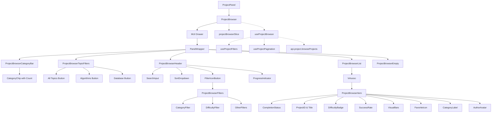
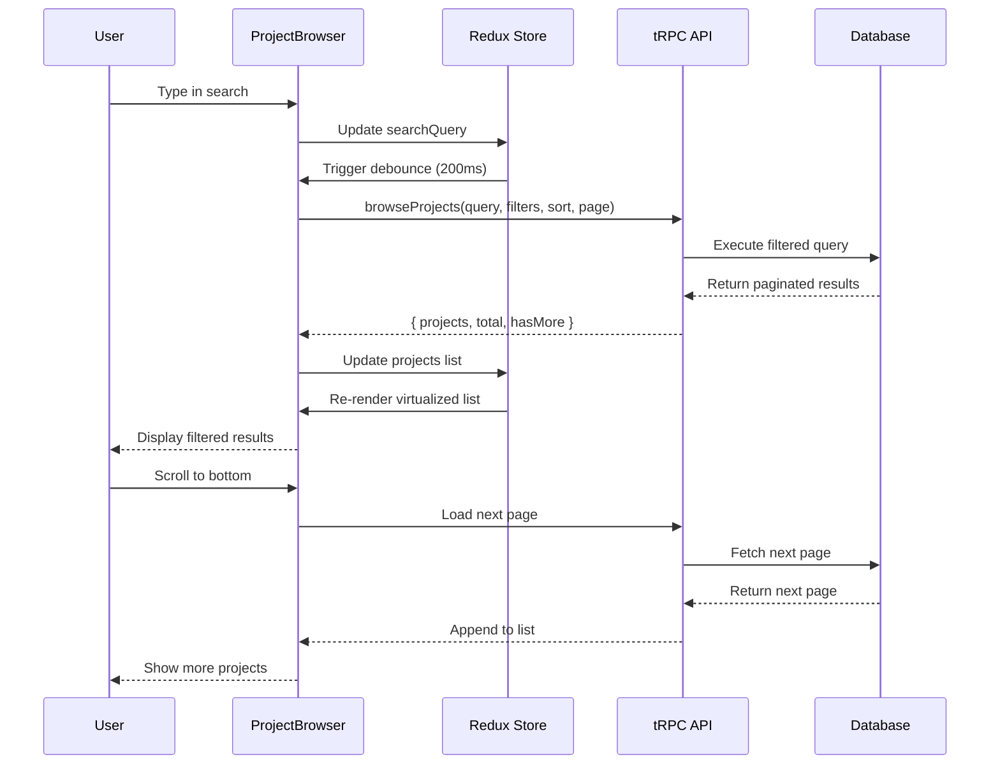

# ProjectBrowser Design Document

## Executive Summary

This document outlines the design and implementation plan for a comprehensive ProjectBrowser component to replace the current `ProjectSelect` dropdown. The new browser will provide advanced filtering, searching, sorting, and pagination capabilities similar to modern coding challenge platforms, optimized for handling large datasets efficiently.

**Overall Implementation Difficulty: 6/10** (Medium-Hard)

**Estimated Total Effort:** 16-21 days (including testing)

**Current Status:**

- ✅ **Phase 1: Foundation** - Complete
- ✅ **Phase 2: Modern UI & Filtering** - Complete
- ⏳ **Phase 3: Performance Optimization** - Pending (API integration, virtualization)
- ⏳ **Phase 4: Polish & Integration** - Partially complete
- ⏳ **Phase 5: Testing** - Pending
- ⏳ **Phase 6: Documentation** - In progress

**Key Challenges:**

- Server-side pagination and filtering (7/10) - ✅ API endpoint created, ⏳ client integration pending
- Performance optimization with virtualization (7/10) - ⏳ Pending
- Complex state management with filters and sorting (6/10) - ✅ Complete
- Comprehensive unit testing with mock data (5/10) - ⏳ Pending

## Current State Analysis

### Existing Implementation (`ProjectSelect.tsx`)

**Limitations:**

- Simple dropdown select component
- All projects loaded at once via `api.project.allBrief.useQuery()`
- Client-side search only (filters by title)
- No pagination or virtualization
- Slow initial render with many projects
- Search feature is flawed (only searches title, no debouncing visible to user)
- Categories shown as ListSubheaders within dropdown
- No advanced filtering (difficulty, category, author)
- No sorting options

**Data Structure:**

```typescript
type ProjectBrief = {
  id: string;
  createdAt: Date;
  slug: string;
  title: string;
  category: ProjectCategory;
  difficulty: ProjectDifficulty | null;
  author: {
    id: string;
    name: string;
    bucketImage: string | null;
  } | null;
};
```

**Available Categories:**

- BINARY_TREE, LINKED_LIST, ARRAY, HEAP, STACK
- TWO_POINTERS, SLIDING_WINDOW, BINARY_SEARCH
- BACKTRACKING, BST, GRAPH, GRID
- DYNAMIC_PROGRAMMING, TRIE, BIT_MANIPULATION, MATH

**Available Difficulties:**

- EASY, MEDIUM, HARD

## Requirements

### Functional Requirements

1. **Location & Entry Point**
   - Opens as a **left-side drawer panel** using MUI Drawer component
   - Slides in from the left with backdrop overlay
   - Clear, intuitive entry point (FolderOpen icon button in ProjectPanel)
   - Should be accessible from the playground page
   - Drawer width: `70vw` (responsive: max 90vw, min 300px)

2. **UI Framework**
   - Use Material-UI (MUI) components consistently
   - **Use MUI Drawer** for the left-side panel (matches existing SidePanel pattern)
   - Follow existing design patterns (PanelWrapper, Drawer, StyledTabPanel, etc.)
   - Match the application's theme and color scheme
   - Drawer styling: backdrop blur, theme-aware opacity (95% dark mode, 98% light mode)

3. **Core Features (Modern Problem Browser Layout)**
   - **Top Category Bar**: Horizontal scrollable bar with category chips showing counts (e.g., "Array: 2037", "String: 826") - clickable filters
   - **Topic Filter Row**: Removed - project only has algorithms, so no topic filtering needed
   - **Search Bar**: Prominent search input with magnifying glass icon, placeholder "Search questions"
   - **Header Controls**:
     - Sort dropdown/button with up/down arrow icon
     - Filter icon button (funnel icon) for advanced filters
     - Progress indicator (optional: "X/Y Solved" with circular progress bar)
   - **Filters**:
     - Category filter (top bar chips - clickable)
     - Difficulty filter (Easy/Medium/Hard toggle buttons in advanced panel)
     - Author filter (Show only mine - placeholder, disabled)
     - Status filter (Show only new projects)
   - **Sorting**:
     - By title (A-Z, Z-A)
     - By difficulty (Easy → Hard, Hard → Easy)
     - By date created (Newest first, Oldest first)
     - By category (alphabetical)
   - **List Items** (Enhanced):
     - Completion status indicator (checkmark for solved/completed)
     - Project ID and title
     - Success rate percentage (optional, if available)
     - Difficulty badge (color-coded: Easy/Med/Hard)
     - Visual indicator bars (popularity/complexity gauge)
     - Favorite/bookmark icon (optional)
     - Category label
     - Author avatar

4. **Performance Requirements**
   - Handle large datasets (1000+ projects) efficiently
   - Implement server-side pagination with infinite scroll
   - Use list virtualization (react-virtuoso)
   - Debounced search input (200ms delay)
   - Optimistic UI updates where appropriate

5. **UX/UI Best Practices**
   - Loading states (skeletons/spinners)
   - Empty states with helpful messages
   - Error states with retry options
   - Smooth scrolling and transitions
   - Keyboard navigation support
   - Clear visual hierarchy
   - Responsive design (mobile-friendly)

6. **Internationalization (I18n)**
   - All text strings translatable via typesafe-i18n
   - Support for: en, ru, de, es, sr, uk
   - Category and difficulty labels already translated

7. **Accessibility (A11y)**
   - ARIA labels and roles
   - Keyboard navigation (Tab, Enter, Arrow keys, Escape)
   - Screen reader support
   - Focus management
   - High contrast support
   - Semantic HTML

## Architecture Design

### Component Structure

```
src/features/project/
├── ui/
│   ├── ProjectBrowser/
│   │   ├── ProjectBrowser.tsx              # Main container (MUI Drawer wrapper)
│   │   ├── ProjectBrowserCategoryBar.tsx   # Top horizontal category chips with counts
│   │   ├── ProjectBrowserTopicFilters.tsx   # Topic filter buttons row (All Topics, Algorithms, etc.)
│   │   ├── ProjectBrowserHeader.tsx        # Search, sort, filter controls
│   │   ├── ProjectBrowserFilters.tsx       # Advanced filter panel (category, difficulty, etc.)
│   │   ├── ProjectBrowserList.tsx          # Virtualized list container
│   │   ├── ProjectBrowserItem.tsx          # Individual project item (enhanced)
│   │   └── ProjectBrowserEmpty.tsx        # Empty state component
│   ├── ProjectSelect.tsx                   # Keep for backward compatibility
│   └── ProjectPanel.tsx                    # Update to include browser entry point
├── model/
│   └── projectBrowserSlice.ts              # Redux slice for browser state
└── hooks/
    ├── useProjectBrowser.ts                # Main hook for browser logic
    ├── useProjectFilters.ts                # Filter management hook
    └── useProjectPagination.ts             # Pagination hook
```

**Implementation Notes:**

- `ProjectBrowser.tsx` wraps content in MUI `Drawer` component with `anchor="left"`
- Drawer width: 400px (max 90vw on mobile for responsiveness)
- Drawer closes on backdrop click, ESC key, or project selection
- Uses `PanelWrapper` inside Drawer for consistent styling

### Component Hierarchy Diagram



**Drawer Implementation:**

- MUI `Drawer` component with `anchor="left"`
- Width: 400px (responsive: max 90vw)
- Backdrop blur effect matching SidePanel pattern
- Theme-aware opacity (95% dark, 98% light)
- Closes on backdrop click, ESC key, or project selection

### State Management

**Redux Slice (`projectBrowserSlice.ts`):**

```typescript
type ProjectBrowserState = {
  // Filters
  searchQuery: string;
  selectedCategories: ProjectCategory[];
  selectedDifficulties: ProjectDifficulty[];
  showOnlyNew: boolean;
  showOnlyMine: boolean;

  // Sorting
  sortBy: "title" | "difficulty" | "date" | "category";
  sortOrder: "asc" | "desc";

  // UI State
  isOpen: boolean;
  isLoading: boolean;
  error: string | null;

  // Pagination
  currentPage: number;
  pageSize: number;
  hasMore: boolean;
};
```

**URL State Management:**

- Use `useSearchParam` hook for persistent filter/sort state
- Enables shareable URLs with filters applied
- Syncs with Redux state

### API Design

**New tRPC Endpoint:**

```typescript
// src/server/api/routers/project.ts

browseProjects: publicProcedure
  .input(
    z.object({
      // Pagination
      page: z.number().min(1).default(1),
      pageSize: z.number().min(1).max(100).default(20),

      // Search
      search: z.string().optional(),

      // Filters
      categories: z.array(z.nativeEnum(ProjectCategory)).optional(),
      difficulties: z.array(z.nativeEnum(ProjectDifficulty)).optional(),
      showOnlyNew: z.boolean().optional(),
      showOnlyMine: z.boolean().optional(),

      // Sorting
      sortBy: z
        .enum(["title", "difficulty", "createdAt", "category"])
        .default("category"),
      sortOrder: z.enum(["asc", "desc"]).default("asc"),
    }),
  )
  .query(async ({ ctx, input }) => {
    // Implementation with Prisma
    // Returns: { projects: ProjectBrief[], total: number, hasMore: boolean }
  });
```

**Implementation Difficulty: 7/10**

**Bundle Impact:** No new dependencies (uses existing tRPC)

**Pros:**

- Type-safe API calls
- Server-side filtering reduces client load
- Efficient database queries
- Built-in caching with tRPC

**Cons:**

- Requires database schema updates for indexes
- More complex than client-side filtering

**Benefits:**

- Server-side filtering reduces data transfer
- Efficient database queries with indexes
- Supports pagination natively
- Can add full-text search later

### Virtualization Strategy

**Using react-virtuoso:**

- Already installed in project (`react-virtuoso@^4.14.0`)
- Use `Virtuoso` component for vertical list
- Estimated item height: 72px (compact) or 96px (detailed)
- Implement infinite scroll with `endReached` callback
- Load next page when user scrolls near bottom

**Implementation Difficulty: 6/10**

**Bundle Impact:** Already included (~45KB gzipped), no additional cost

**Example Structure:**

```typescript
<Virtuoso
  data={projects}
  totalCount={total}
  endReached={() => loadNextPage()}
  itemContent={(index, project) => (
    <ProjectBrowserItem project={project} />
  )}
  components={{
    Header: ProjectBrowserHeader,
    EmptyPlaceholder: ProjectBrowserEmpty,
  }}
/>
```

## UI/UX Design

### Layout Structure (Modern Problem Browser Style)

**Drawer Panel (Left Side) - Reference Layout:**

```
┌─────────────────────────────────────────┐
│  [Backdrop Overlay - Blurred]          │
│  ┌───────────────────────────────────┐  │
│  │  ProjectBrowser (Drawer)          │  │
│  │  Width: 400px (max 90vw mobile)  │  │
│  │                                    │  │
│  │  ┌─────────────────────────────┐  │  │
│  │  │ TOP CATEGORY BAR            │  │  │
│  │  │ [Array: 2037] [String: 826] │  │  │
│  │  │ [Hash Table: 752] [Math...] │  │  │
│  │  │ (Horizontal scrollable)     │  │  │
│  │  └─────────────────────────────┘  │  │
│  │                                    │  │
│  │  ┌─────────────────────────────┐  │  │
│  │  │ TOPIC FILTER ROW             │  │  │
│  │  │ [✓ All Topics] [Algorithms]  │  │  │
│  │  │ [Database] [pandas] [JS...]  │  │  │
│  │  └─────────────────────────────┘  │  │
│  │                                    │  │
│  │  ┌─────────────────────────────┐  │  │
│  │  │ HEADER CONTROLS              │  │  │
│  │  │ [🔍 Search questions]        │  │  │
│  │  │ [↓↑ Sort] [∇ Filter] [1473/│  │  │
│  │  │  3739 Solved ▓▓▓░░░░░░]     │  │  │
│  │  └─────────────────────────────┘  │  │
│  │                                    │  │
│  │  ┌─────────────────────────────┐  │  │
│  │  │ VIRTUALIZED LIST            │  │  │
│  │  │ ┌─────────────────────────┐ │  │  │
│  │  │ │ ✓ 1611. Minimum One... │ │  │  │
│  │  │ │    78.4% [Hard] ▓▓▓▓▓  │ │  │  │
│  │  │ └─────────────────────────┘ │  │  │
│  │  │ ┌─────────────────────────┐ │  │  │
│  │  │ │   1. Two Sum           │ │  │  │
│  │  │ │    56.5% [Easy] ▓▓▓▓   │ │  │  │
│  │  │ └─────────────────────────┘ │  │  │
│  │  │ ... (virtualized)          │  │  │
│  │  └─────────────────────────────┘  │  │
│  └───────────────────────────────────┘  │
└─────────────────────────────────────────┘
```

**Layout Components Breakdown:**

1. **Top Category Bar** (`ProjectBrowserCategoryBar.tsx`):
   - Horizontal scrollable row of category chips
   - Each chip shows: `[Category Name]: [Count]`
   - Examples: "Array: 2037", "String: 826", "Hash Table: 752"
   - Clickable to filter by category
   - Active state highlighting
   - Uses MUI `Chip` component with horizontal scroll

2. **Topic Filter Row** (`ProjectBrowserTopicFilters.tsx`):
   - Horizontal row of topic buttons
   - Topics: "All Topics", "Algorithms", "Database", "pandas", "JavaScript", "Shell", "Concurrency"
   - Selected topic highlighted (e.g., "All Topics" with checkmark/trash icon)
   - Each button has icon + text
   - Uses MUI `ToggleButtonGroup` or `ButtonGroup`

3. **Header Controls** (`ProjectBrowserHeader.tsx`):
   - **Search Bar**: Full-width input with magnifying glass icon, placeholder "Search questions"
   - **Sort Control**: Icon button with up/down arrows (↓↑) - opens sort menu
   - **Filter Button**: Icon button with funnel icon (∇) - opens advanced filter panel
   - **Progress Indicator** (optional): "X/Y Solved" with circular progress bar (if tracking completion)

4. **Enhanced List Items** (`ProjectBrowserItem.tsx`):
   - **Completion Status**: Green checkmark (✓) for solved/completed projects
   - **Project ID & Title**: "1611. Minimum One Bit Operations..."
   - **Success Rate**: Percentage (e.g., "78.4%") - optional if available
   - **Difficulty Badge**: Color-coded (Easy/Med/Hard) with appropriate colors
   - **Visual Bars**: Small vertical bars indicating popularity/complexity
   - **Favorite Icon**: Star icon (optional) for bookmarked projects
   - **Category Label**: Subtle text below title
   - **Author Avatar**: Small avatar on the right

**Drawer Specifications:**

- **Width:** 400px (desktop), max 90vw (mobile)
- **Anchor:** Left side
- **Backdrop:** Blurred overlay (closes drawer on click)
- **Animation:** Slide-in from left with smooth transition
- **Theme:** Backdrop opacity 95% (dark) / 98% (light)
- **Close triggers:** Backdrop click, ESC key, project selection
- **Entry point:** FolderOpen icon button in ProjectPanel toolbar

### Project Item Design

**Compact View (Default):**

```
┌──────────────────────────────────────────────┐
│ Title                    [Easy] [New] [👤]  │
│ Category: Array                              │
└──────────────────────────────────────────────┘
```

**Detailed View (Hover/Selected):**

```
┌──────────────────────────────────────────────┐
│ Title                    [Easy] [New] [👤]  │
│ Category: Array                             │
│ Created: 2 days ago                         │
│ Author: John Doe                            │
└──────────────────────────────────────────────┘
```

### Filter UI

**Category Filter:**

- Multi-select chip group
- "Select All" / "Clear All" buttons
- Visual count badges

**Difficulty Filter:**

- Toggle buttons (Easy/Medium/Hard)
- Color-coded (green/yellow/red)

**Other Filters:**

- Checkboxes for "Show only new projects"
- Checkbox for "Show only my projects" (if authenticated)

### Search UI

- Full-width search input at top
- Debounced (200ms)
- Clear button (X icon)
- Search icon prefix
- Placeholder: "Search projects by title..."

### Sort UI

- Dropdown select
- Options:
  - "Title (A-Z)"
  - "Title (Z-A)"
  - "Difficulty (Easy → Hard)"
  - "Difficulty (Hard → Easy)"
  - "Date (Newest First)"
  - "Date (Oldest First)"
  - "Category (A-Z)"

## Implementation Phases

### Phase 1: Foundation (Week 1) - **Difficulty: 4/10**

1. Create component structure - **Difficulty: 2/10** ✅
2. Set up Redux slice - **Difficulty: 3/10** ✅
3. Create basic UI layout with MUI Drawer - **Difficulty: 4/10** ✅
   - Implement MUI Drawer as left-side panel
   - Configure drawer width (70vw, max 90vw, min 300px)
   - Add backdrop blur and theme-aware opacity
   - Handle drawer open/close state
   - Add entry point button (FolderOpen icon) in ProjectPanel
4. Implement search input - **Difficulty: 4/10** ✅
5. Basic project list (no virtualization yet) - **Difficulty: 3/10** ✅

**Total Estimated Effort:** 2-3 days

**Phase 1 Implementation Notes:**

- ✅ Implemented MUI Drawer with `anchor="left"` (70vw width, max 90vw, min 300px)
- ✅ Drawer closes on backdrop click, ESC key, and project selection
- ✅ Styling matches existing SidePanel pattern (backdrop blur, theme-aware)
- ✅ Entry point: FolderOpen icon button in ProjectPanel toolbar
- ✅ Uses PanelWrapper inside Drawer for consistent styling
- ✅ Uses `slotProps.paper` (MUI v6+ API, avoiding deprecated `PaperProps`)

### Phase 2: Filtering & Sorting (Week 1-2) - **Difficulty: 6/10** ✅ **COMPLETE**

1. ✅ Implement filter UI components - **Difficulty: 5/10**
2. ✅ Add filter logic to Redux - **Difficulty: 4/10**
3. ✅ Implement sorting UI and logic - **Difficulty: 5/10**
4. ✅ Create API endpoint with filtering - **Difficulty: 7/10**
5. ⏳ Connect client to API endpoint - **Difficulty: 6/10** (Pending in Phase 3)

**Total Estimated Effort:** 4-5 days  
**Actual Status:** Phase 2 complete, API endpoint ready for integration

### Phase 3: Performance Optimization (Week 2) - **Difficulty: 7/10**

1. Implement server-side pagination API - **Difficulty: 7/10**
2. Add react-virtuoso virtualization - **Difficulty: 6/10**
3. Implement infinite scroll - **Difficulty: 6/10**
4. Add loading states - **Difficulty: 3/10**
5. Optimize re-renders - **Difficulty: 7/10**

**Total Estimated Effort:** 3-4 days

### Phase 4: Polish & Integration (Week 2-3) - **Difficulty: 5/10**

1. Add empty states - **Difficulty: 3/10**
2. Add error handling - **Difficulty: 4/10**
3. Implement keyboard navigation - **Difficulty: 6/10**
4. Add I18n translations - **Difficulty: 4/10**
5. Accessibility improvements - **Difficulty: 6/10**
6. Integration with ProjectPanel - **Difficulty: 5/10**

**Total Estimated Effort:** 4-5 days

### Phase 5: Testing (Week 3) - **Difficulty: 5/10**

1. Set up mock data generators - **Difficulty: 3/10**
2. Write unit tests for business logic - **Difficulty: 3/10**
3. Write unit tests for Redux slice - **Difficulty: 4/10**
4. Write unit tests for components - **Difficulty: 4/10**
5. Write unit tests for custom hooks - **Difficulty: 5/10**
6. Write unit tests for API endpoint - **Difficulty: 6/10**
7. Write integration tests - **Difficulty: 5/10**
8. Achieve coverage goals - **Difficulty: 4/10**

**Total Estimated Effort:** 3-4 days

**Note:** Testing should be done incrementally alongside implementation, not only at the end

### Phase 6: Advanced Features (Future) - **Difficulty: 8/10**

1. Save filter presets - **Difficulty: 7/10**
2. Recent searches - **Difficulty: 6/10**
3. Project favorites/bookmarks - **Difficulty: 8/10**
4. Advanced search (description, tags) - **Difficulty: 8/10**
5. Export filtered results - **Difficulty: 5/10**

**Total Estimated Effort:** TBD (Future enhancement)

## Technical Considerations

### Performance Optimizations

1. **Debouncing:**
   - Search input: 200ms debounce
   - Filter changes: 300ms debounce (if needed)

2. **Memoization:**
   - Memoize filtered/sorted project lists
   - Memoize project item components
   - Use React.memo for expensive components

3. **Virtualization:**
   - Only render visible items
   - Estimate item heights accurately
   - Use overscan for smooth scrolling

4. **API Optimization:**
   - Database indexes on: title, category, difficulty, createdAt
   - Limit initial page size (20 items)
   - Use cursor-based pagination if needed

### Accessibility Features

1. **Keyboard Navigation:**
   - Tab: Navigate between controls
   - Enter: Select project
   - Arrow Up/Down: Navigate list
   - Escape: Close browser
   - Ctrl/Cmd + F: Focus search

2. **ARIA Labels:**
   - `aria-label` for all interactive elements
   - `aria-expanded` for filters
   - `aria-live` for loading states
   - `role="list"` for project list
   - `role="listitem"` for each project

3. **Screen Reader Support:**
   - Announce filter changes
   - Announce search results count
   - Announce loading states
   - Descriptive alt text for avatars

### Error Handling

1. **Network Errors:**
   - Show error message
   - Provide retry button
   - Fallback to cached data if available

2. **Empty States:**
   - No projects found: "No projects match your filters"
   - No search results: "No projects found for '{query}'"
   - Empty database: "No projects available"

3. **Loading States:**
   - Skeleton loaders for list items
   - Loading spinner for initial load
   - Subtle loading indicator for pagination

## I18n Translation Keys

New keys needed:

```typescript
PROJECT_BROWSER: "Project Browser";
SEARCH_PROJECTS: "Search projects by title...";
FILTER_BY_CATEGORY: "Filter by category";
FILTER_BY_DIFFICULTY: "Filter by difficulty";
SHOW_ONLY_NEW: "Show only new projects";
SHOW_ONLY_MINE: "Show only my projects";
SORT_BY: "Sort by";
SORT_TITLE_ASC: "Title (A-Z)";
SORT_TITLE_DESC: "Title (Z-A)";
SORT_DIFFICULTY_ASC: "Difficulty (Easy → Hard)";
SORT_DIFFICULTY_DESC: "Difficulty (Hard → Easy)";
SORT_DATE_ASC: "Date (Newest First)";
SORT_DATE_DESC: "Date (Oldest First)";
SORT_CATEGORY_ASC: "Category (A-Z)";
NO_PROJECTS_FOUND: "No projects found";
NO_PROJECTS_MATCH_FILTERS: "No projects match your filters";
LOADING_PROJECTS: "Loading projects...";
LOAD_MORE: "Load more";
CLEAR_FILTERS: "Clear all filters";
SELECT_ALL_CATEGORIES: "Select all categories";
```

## Testing Strategy

### Unit Tests (Essential Coverage)

**Priority: High** - Write unit tests immediately after implementation

#### Business Logic Tests

- **Filter logic** - **Difficulty: 3/10**
  - Test category filtering
  - Test difficulty filtering
  - Test combined filters
  - Test "show only new" filter
  - Test "show only mine" filter
  - **Mock Data:** Generate mock projects with various categories/difficulties

- **Sort logic** - **Difficulty: 3/10**
  - Test sorting by title (asc/desc)
  - Test sorting by difficulty (asc/desc)
  - Test sorting by date (asc/desc)
  - Test sorting by category
  - **Mock Data:** Projects with varied titles, difficulties, dates

- **Search logic** - **Difficulty: 2/10**
  - Test title matching (case-insensitive)
  - Test partial matches
  - Test empty search
  - Test special characters
  - **Mock Data:** Projects with varied titles

#### Redux Slice Tests

- **projectBrowserSlice reducers** - **Difficulty: 4/10**
  - Test all action creators
  - Test state updates
  - Test filter state management
  - Test pagination state
  - **Mock Data:** Initial state, action payloads

#### Component Tests

- **ProjectBrowserItem** - **Difficulty: 4/10**
  - Test rendering with different project data
  - Test click handler
  - Test selected state styling
  - Test difficulty badge display
  - Test author avatar display
  - **Mock Data:** Mock project objects

- **ProjectBrowserFilters** - **Difficulty: 5/10**
  - Test category selection
  - Test difficulty toggles
  - Test "clear all" functionality
  - Test filter state updates
  - **Mock Data:** Mock filter state, category/difficulty arrays

- **Search Input** - **Difficulty: 3/10**
  - Test debouncing (200ms)
  - Test clear button
  - Test input changes
  - **Mock Data:** Mock search queries

#### Custom Hooks Tests

- **useProjectBrowser** - **Difficulty: 5/10**
  - Test data fetching
  - Test filter application
  - Test pagination
  - Test error handling
  - **Mock Data:** Mock tRPC query responses

- **useProjectFilters** - **Difficulty: 4/10**
  - Test filter state management
  - Test filter combinations
  - Test filter reset
  - **Mock Data:** Mock filter state

- **useProjectPagination** - **Difficulty: 4/10**
  - Test page navigation
  - Test infinite scroll trigger
  - Test hasMore logic
  - **Mock Data:** Mock pagination responses

#### API Endpoint Tests

- **browseProjects procedure** - **Difficulty: 6/10**
  - Test with various filter combinations
  - Test pagination
  - Test sorting
  - Test search query
  - Test error cases
  - **Mock Data:** Mock Prisma queries, mock database results

### Mock Data Structure

```typescript
// Mock project generator
const createMockProject = (
  overrides?: Partial<ProjectBrief>,
): ProjectBrief => ({
  id: faker.string.uuid(),
  createdAt: faker.date.recent(),
  slug: faker.lorem.slug(),
  title: faker.lorem.words(3),
  category: faker.helpers.arrayElement(Object.values(ProjectCategory)),
  difficulty: faker.helpers.arrayElement([
    ...Object.values(ProjectDifficulty),
    null,
  ]),
  author: {
    id: faker.string.uuid(),
    name: faker.person.fullName(),
    bucketImage: faker.image.avatar(),
  },
  ...overrides,
});

// Mock projects array generator
const createMockProjects = (
  count: number,
  overrides?: Partial<ProjectBrief>[],
): ProjectBrief[] =>
  Array.from({ length: count }, (_, i) => createMockProject(overrides?.[i]));

// Mock API response
const createMockBrowseResponse = (
  projects: ProjectBrief[],
  hasMore: boolean,
) => ({
  projects,
  total: projects.length,
  hasMore,
});
```

### Integration Tests

- **API endpoint with various filters** - **Difficulty: 5/10**
- **Pagination flow** - **Difficulty: 5/10**
- **Filter combinations** - **Difficulty: 5/10**
- **Search + Filter + Sort integration** - **Difficulty: 6/10**

### E2E Tests (Optional - Lower Priority)

- Open browser
- Search for project
- Apply filters
- Sort projects
- Select project
- Keyboard navigation

### Performance Tests

- Render time with 1000+ projects
- Scroll performance
- Search debounce timing
- API response times

### Test Coverage Goals

- **Unit Tests:** 80%+ coverage for business logic
- **Component Tests:** 70%+ coverage for complex components
- **Integration Tests:** Critical user flows
- **Focus Areas:**
  - Filter logic (100% coverage)
  - Sort logic (100% coverage)
  - Redux reducers (100% coverage)
  - API error handling (100% coverage)

## Migration Strategy

1. **Backward Compatibility:**
   - Keep `ProjectSelect` component
   - Add toggle between Select and Browser
   - Default to Browser, allow fallback to Select

2. **Gradual Rollout:**
   - Feature flag for browser
   - A/B testing (optional)
   - Collect user feedback

3. **Deprecation:**
   - After browser is stable, deprecate Select
   - Remove Select after migration period

## Success Metrics

1. **Performance:**
   - Initial render < 200ms
   - Search response < 100ms
   - Smooth scrolling (60fps)

2. **User Experience:**
   - Reduced time to find project
   - Increased project discovery
   - Positive user feedback

3. **Technical:**
   - Zero memory leaks
   - Proper error handling
   - Full test coverage

## Implementation Status Summary

### Completed ✅

- **Phase 1: Foundation** - All components created, Redux slice implemented, basic UI working
- **Phase 2: Modern UI & Filtering** - Complete UI with category bar, topic filters (simplified), advanced filters, sorting, enhanced list items
- **API Endpoint** - `browseProjects` endpoint created with filtering, sorting, and pagination
- **Database Indexes** - Added to Prisma schema (migration pending: run `pnpm prisma migrate dev`)

### In Progress ⏳

- **Phase 3: Performance Optimization** - API integration, virtualization, infinite scroll
- **Phase 4: Polish** - I18n translations, error handling, keyboard navigation improvements
- **Phase 5: Testing** - Unit tests, integration tests

### Pending Actions ⚠️

- **Database Migration** - Run `pnpm prisma migrate dev` to apply indexes
- **Translation Types** - Run `pnpm typesafe-i18n` to update types (runs as file watcher)
- **Client-Side API Integration** - Replace `allBrief` with `browseProjects` in components

## Open Questions

1. Should we support saved filter presets?
2. Do we need project favorites/bookmarks?
3. Should search include project descriptions?
4. Do we need advanced search (tags, multiple criteria)?
5. Should we show project statistics (views, likes)?

## References

- [react-virtuoso Documentation](https://virtuoso.dev/)
- [MUI Data Grid Patterns](https://mui.com/x/react-data-grid/)
- [WCAG 2.1 Guidelines](https://www.w3.org/WAI/WCAG21/quickref/)

## Appendix

### Database Indexes Needed

```sql
-- For search
CREATE INDEX idx_project_title ON PlaygroundProject(title);

-- For filtering
CREATE INDEX idx_project_category ON PlaygroundProject(category);
CREATE INDEX idx_project_difficulty ON PlaygroundProject(difficulty);
CREATE INDEX idx_project_created ON PlaygroundProject(createdAt);

-- Composite for common queries
CREATE INDEX idx_project_category_difficulty ON PlaygroundProject(category, difficulty);
```

**Implementation Difficulty: 2/10** (Database migration)

**Impact:** Improves query performance significantly, minimal code changes required

### Data Flow Diagram



### Component Props Interfaces

```typescript
interface ProjectBrowserProps {
  onSelectProject?: (projectSlug: string) => void;
  initialFilters?: Partial<ProjectBrowserState>;
}

interface ProjectBrowserItemProps {
  project: ProjectBrief;
  isSelected: boolean;
  onClick: () => void;
}

interface ProjectBrowserFiltersProps {
  categories: ProjectCategory[];
  difficulties: ProjectDifficulty[];
  selectedCategories: ProjectCategory[];
  selectedDifficulties: ProjectDifficulty[];
  onCategoryChange: (categories: ProjectCategory[]) => void;
  onDifficultyChange: (difficulties: ProjectDifficulty[]) => void;
}
```

### Implementation Status

**Phase 1: Foundation - ✅ COMPLETED**

- ✅ Component structure created
- ✅ Redux slice implemented and registered
- ✅ MUI Drawer implemented as left-side panel
- ✅ Search input integrated with Redux
- ✅ Basic project list displaying (client-side filtering)
- ✅ Entry point button added to ProjectPanel
- ✅ I18n translations added

**Key Implementation Details:**

- Drawer width: 400px (max 90vw on mobile)
- Drawer anchor: left
- Backdrop blur with theme-aware opacity
- Closes on backdrop click, ESC key, or project selection
- Uses PanelWrapper inside Drawer for consistent styling
