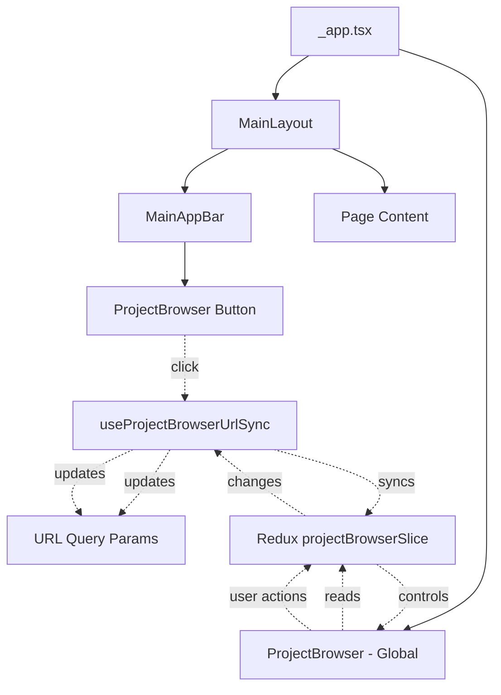
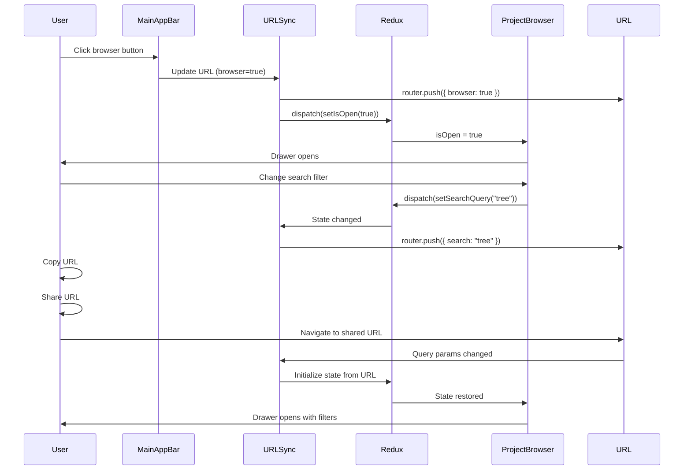

# ProjectBrowser Global Availability & URL State Design Document

## Executive Summary

This document outlines the design and implementation plan for making the ProjectBrowser drawer component globally available from the header and synchronizing its state (open/close and filters) with URL query parameters. This enables users to share filtered project lists via URLs and improves navigation consistency across the application.

**Overall Implementation Difficulty: 4/10** (Medium)

**Estimated Total Effort:** 2-4 days (including testing)

**Key Benefits:**

- Global accessibility: Open project browser from any page via header button
- Shareable URLs: Copy and share filtered project lists with others
- Better UX: Browser state persists across navigation
- Deep linking: Direct links to specific filtered views
- Consistent with existing patterns: Uses same `useSearchParam` pattern as modals and filters

**Key Challenges:**

- URL query parameter synchronization (4/10) - Sync Redux state with URL using existing pattern
- Global component placement (3/10) - Add to app layout
- State initialization from URL (3/10) - Parse URL on mount using `useSearchParam` hooks
- Backward compatibility (2/10) - Existing ProjectPanel usage should still work

## Current State Analysis

### Existing Implementation

**Current Location:**

- `ProjectBrowser` component is currently only rendered in `ProjectPanel.tsx` (playground page)
- Opened via IconButton with FolderOpen icon in ProjectPanel toolbar
- State managed entirely in Redux (`projectBrowserSlice`)

**Current State Management:**

```typescript
// Redux state in projectBrowserSlice.ts
type ProjectBrowserState = {
  // Filters
  searchQuery: string;
  selectedCategories: ProjectCategory[];
  selectedDifficulties: ProjectDifficulty[];
  showOnlyNew: boolean;
  showOnlyMine: boolean;

  // Sorting
  sortBy: "title" | "difficulty" | "date" | "category";
  sortOrder: "asc" | "desc";

  // UI State
  isOpen: boolean;  // Currently only in Redux

  // Pagination
  currentPage: number;
  pageSize: number;
  hasMore: boolean;

  // Accumulated projects
  accumulatedProjects: ProjectBrief[];
  lastQueryKey: string;
};
```

**Current Entry Points:**

- `ProjectPanel.tsx` - IconButton in toolbar (line 164-168)
- Opens drawer via `dispatch(projectBrowserSlice.actions.setIsOpen(true))`

**Existing URL Query Patterns:**

- `useSearchParam` hook exists for single query param management
- `usePlaygroundSlugs` hook manages playground route slugs
- Next.js router with shallow routing for URL updates

**Modal Pattern Example (PythonSupportModal):**

```typescript
// In CodePanel.tsx
const [modalName, setModalName] = useSearchParam("modal");

// Open modal
setModalName(PYTHON_SUPPORT_MODAL_ID); // "python-support"

// Close modal
setModalName("");

// Check if open
<PythonSupportModal open={modalName === PYTHON_SUPPORT_MODAL_ID} />
```

**Multiple URL Params Pattern:**

```typescript
// In CodePanel.tsx - multiple independent params
const [runMode] = useSearchParam("mode");
const [language, setLanguage] = useSearchParam<ProgrammingLanguage>("language", {
  defaultValue: "javascript",
  validate: isLanguageValid,
});
const [modalName, setModalName] = useSearchParam("modal");
```

**Key Pattern Characteristics:**

- Each URL param uses its own `useSearchParam` hook
- Empty string (`""`) means "not set" / "closed" / "default"
- Validation functions for type safety
- Shallow routing automatically handled by hook
- No complex sync hooks needed - each param is independent

## Requirements

### Functional Requirements

1. **Global Availability**
   - Add ProjectBrowser button to `MainAppBar` header component
   - Button should be visible on all pages (not just playground)
   - Use FolderOpen icon (consistent with current design)
   - Button should be accessible via keyboard navigation
   - Tooltip should indicate "Project Browser" or similar

2. **URL Query State Synchronization**
   - `isOpen` state should be controlled by URL query parameter `browser` (boolean)
   - Filter states should be stored in URL query parameters:
     - `search` - search query string
     - `categories` - comma-separated category list
     - `difficulties` - comma-separated difficulty list
     - `showOnlyNew` - boolean flag
     - `sortBy` - sort field name
     - `sortOrder` - "asc" or "desc"
   - URL should update when filters change (shallow routing)
   - Redux state should initialize from URL on mount
   - URL should update when Redux state changes (bidirectional sync)

3. **Shareability**
   - URLs with query parameters should open browser with same filters
   - Copying URL should preserve all filter states
   - Opening shared URL should restore exact filter state
   - Browser should close when URL query parameter is removed

4. **Backward Compatibility**
   - Existing ProjectPanel usage should continue to work
   - Redux actions should still function (but sync to URL)
   - No breaking changes to existing API

### Technical Requirements

1. **Component Architecture**
   - Move `ProjectBrowser` rendering to global layout (`_app.tsx` or `MainLayout.tsx`)
   - Keep component logic in `ProjectBrowser.tsx` (no changes needed)
   - Add URL sync hook: `useProjectBrowserUrlSync.ts`

2. **State Management**
   - Redux state remains primary source of truth
   - URL query parameters are derived state (synced from Redux)
   - URL changes trigger Redux updates (on mount and route changes)
   - Redux changes trigger URL updates (debounced for performance)

3. **URL Query Parameter Mapping**

   | Redux State            | URL Query Param | Type    | Format                                    |
   | ---------------------- | --------------- | ------- | ----------------------------------------- |
   | `isOpen`               | `browser`       | boolean | `true`/`false` or `1`/`0`                 |
   | `searchQuery`          | `search`        | string  | URL-encoded string                        |
   | `selectedCategories`   | `categories`    | array   | Comma-separated: `ARRAY,HEAP,STACK`       |
   | `selectedDifficulties` | `difficulties`  | array   | Comma-separated: `EASY,MEDIUM`            |
   | `showOnlyNew`          | `new`           | boolean | `true`/`false` or `1`/`0`                 |
   | `sortBy`               | `sortBy`        | string  | `title`, `difficulty`, `date`, `category` |
   | `sortOrder`            | `sortOrder`     | string  | `asc` or `desc`                           |

4. **URL Format Examples**

   ```text
   # Open browser with search
   /playground?browser=true&search=binary%20tree

   # Open browser with categories and difficulties
   /playground?browser=true&categories=ARRAY,HEAP&difficulties=EASY,MEDIUM

   # Open browser with all filters
   /playground?browser=true&search=tree&categories=ARRAY&difficulties=EASY&new=true&sortBy=title&sortOrder=asc

   # Browser closed (no browser param or browser=false)
   /playground
   ```

5. **Performance Considerations**
   - Debounce URL updates when filters change rapidly (300ms)
   - Use shallow routing to avoid full page reloads
   - Parse URL only on mount and route changes (not on every render)
   - Clear URL params when browser closes (unless explicitly keeping state)

## Architecture Design

### Component Structure

```text
src/
├── features/
│   ├── project/
│   │   ├── ui/
│   │   │   └── ProjectBrowser/
│   │   │       └── ProjectBrowser.tsx (add URL sync logic)
│   │   └── hooks/
│   │       └── (no new hook needed - use useSearchParam directly)
│   └── appBar/
│       └── ui/
│           └── MainAppBar.tsx (add button)
├── pages/
│   └── _app.tsx (add global ProjectBrowser)
└── shared/
    └── hooks/
        └── useSearchParam.ts (existing - no changes needed)
```

### Component Hierarchy Diagram



### State Flow Diagram



### URL Synchronization Pattern

**Following Existing Pattern:**

Instead of a complex sync hook, we'll use individual `useSearchParam` hooks for each parameter, consistent with the existing modal and filter patterns in the codebase.

**In ProjectBrowser Component:**

```typescript
// Use individual useSearchParam hooks (following CodePanel pattern)
const [browserParam, setBrowserParam] = useSearchParam("browser");
const [searchParam, setSearchParam] = useSearchParam("search");
const [categoriesParam, setCategoriesParam] = useSearchParam("categories");
const [difficultiesParam, setDifficultiesParam] = useSearchParam("difficulties");
const [newParam, setNewParam] = useSearchParam("new");
const [sortByParam, setSortByParam] = useSearchParam("sortBy");
const [sortOrderParam, setSortOrderParam] = useSearchParam("sortOrder");

// Sync URL → Redux on mount and route changes
useEffect(() => {
  // Parse URL params and update Redux
  dispatch(projectBrowserSlice.actions.setIsOpen(browserParam === "true"));
  if (searchParam) dispatch(projectBrowserSlice.actions.setSearchQuery(searchParam));
  // ... etc
}, [browserParam, searchParam, categoriesParam, ...]);

// Sync Redux → URL when Redux changes
useEffect(() => {
  if (isOpen !== (browserParam === "true")) {
    setBrowserParam(isOpen ? "true" : "");
  }
}, [isOpen, browserParam, setBrowserParam]);
// ... similar for other params
```

**Helper Functions for Array Parsing:**

```typescript
// Parse comma-separated arrays
const parseCategories = (value: string): ProjectCategory[] => {
  if (!value) return [];
  return value.split(",").filter((cat): cat is ProjectCategory =>
    Object.values(ProjectCategory).includes(cat as ProjectCategory)
  );
};

const serializeCategories = (categories: ProjectCategory[]): string => {
  return categories.length > 0 ? categories.join(",") : "";
};
```

### Integration Points

1. **MainAppBar Integration**
   - Add FolderOpen IconButton to header
   - Position: Right side, before user menu (consistent with ProjectPanel)
   - Click handler: Use `useSearchParam("browser")` hook, set to `"true"` to open
   - Tooltip: "Project Browser" (i18n)
   - Pattern: Follow same pattern as modal opening (set param to value, empty string to close)

2. **Global ProjectBrowser Rendering**
   - Add `<ProjectBrowser />` to `_app.tsx` (outside page-specific layouts)
   - Component will read Redux state (already does)
   - URL sync hook will manage state synchronization

3. **URL Sync Hook Integration**
   - Hook should be called in `ProjectBrowser.tsx` or `_app.tsx`
   - Initialize on mount
   - Listen to route changes
   - Debounce URL updates

## UI/UX Design

### Header Button Placement

**Desktop Layout:**

```text
[Logo] [dStruct] [Playground] ... [ProjectBrowser] [UserMenu]
```

**Mobile Layout:**

```text
[Hamburger] [Logo] [dStruct] ... [ProjectBrowser] [UserMenu]
```

**Button Design:**

- Icon: `FolderOpen` from `@mui/icons-material`
- Size: Medium (consistent with other header buttons)
- Tooltip: "Project Browser" (translatable)
- Position: Right side, before user menu avatar
- Keyboard accessible: Tab navigation, Enter/Space to activate

### URL State Behavior

**Opening Browser:**

- Click header button → URL updates to `?browser=true`
- Browser opens with current filter state (if any)
- If URL already has filter params, browser opens with those filters

**Closing Browser:**

- Click close button or backdrop → URL updates to remove `browser` param
- Filter params can remain in URL (for sharing) or be cleared
- Option: Clear all browser-related params when closing

**Sharing URLs:**

- User applies filters → URL updates automatically
- User copies URL → All filter state preserved
- Recipient opens URL → Browser opens with same filters
- Browser state fully restored from URL

## Implementation Phases

### Phase 1: URL Synchronization (Difficulty: 4/10)

**Tasks:**

1. Add `useSearchParam` hooks to `ProjectBrowser.tsx` for each URL parameter
2. Implement URL → Redux sync (on mount and route changes via useEffect)
3. Implement Redux → URL sync (when Redux state changes)
4. Add parsing/serialization helpers for arrays (categories, difficulties)
5. Add parsing/serialization helpers for booleans (browser, new)
6. Handle edge cases (invalid params, missing values)

**Estimated Time:** 1-1.5 days

**Dependencies:** None

**Pattern:** Follow existing `CodePanel.tsx` pattern with multiple `useSearchParam` hooks

### Phase 2: Global Component Placement (Difficulty: 3/10)

**Tasks:**

1. Move `ProjectBrowser` rendering from `ProjectPanel.tsx` to `_app.tsx`
2. Ensure component works globally (no page-specific dependencies)
3. Test that ProjectPanel still works (may need to keep local instance or remove)
4. Verify drawer positioning and z-index work globally

**Estimated Time:** 0.5-1 day

**Dependencies:** Phase 1 (for URL sync)

### Phase 3: Header Button Integration (Difficulty: 3/10)

**Tasks:**

1. Add FolderOpen IconButton to `MainAppBar.tsx`
2. Add click handler to update URL query parameter
3. Add i18n translation key for tooltip
4. Style button consistently with header design
5. Add keyboard accessibility (Tab, Enter/Space)

**Estimated Time:** 0.5-1 day

**Dependencies:** Phase 1, Phase 2

### Phase 4: Testing & Edge Cases (Difficulty: 4/10)

**Tasks:**

1. Test URL sharing scenarios
2. Test browser open/close from header
3. Test filter state persistence across navigation
4. Test URL parsing with invalid/missing params
5. Test backward compatibility with ProjectPanel
6. Test mobile responsiveness
7. Test keyboard navigation

**Estimated Time:** 1 day

**Dependencies:** Phase 1, Phase 2, Phase 3

### Phase 5: Documentation & Polish (Difficulty: 2/10)

**Tasks:**

1. Update component documentation
2. Add JSDoc comments to URL sync hook
3. Document URL query parameter format
4. Update user-facing documentation if needed

**Estimated Time:** 0.5 day

**Dependencies:** All phases

## Performance Considerations

### URL Update Debouncing

- **Note:** `useSearchParam` hook already handles URL updates efficiently
- **No additional debouncing needed:** Each param update is independent and uses shallow routing
- **Rationale:** Shallow routing is fast, and individual param updates don't conflict

### Shallow Routing

- **Use shallow routing:** `router.push({ query }, undefined, { shallow: true })`
- **Benefits:** No full page reload, faster updates
- **Trade-off:** URL changes don't trigger `getServerSideProps` (acceptable for client-side state)

### URL Parsing Optimization

- **Parse only on mount and route changes:** Use `useEffect` with `router.query` dependency
- **Memoize parsed values:** Avoid re-parsing on every render
- **Validate before applying:** Ensure parsed values match expected types

### State Initialization

- **Initialize from URL once:** On mount, not on every render
- **Handle missing params:** Use defaults from Redux initial state
- **Validate param values:** Ensure categories/difficulties are valid enum values

## I18n Requirements

### Translation Keys

Add to `src/i18n/en/index.ts` (and other locales):

```typescript
PROJECT_BROWSER: "Project Browser",
OPEN_PROJECT_BROWSER: "Open Project Browser",
```

**Locales to update:** en, ru, de, es, sr, uk

**Note:** `PROJECT_BROWSER` already exists, may need `OPEN_PROJECT_BROWSER` for tooltip

## Accessibility (A11y) Requirements

1. **Keyboard Navigation**
   - Header button accessible via Tab key
   - Enter/Space activates button
   - Escape closes browser (already implemented)

2. **ARIA Labels**
   - Button: `aria-label="Open Project Browser"`
   - Tooltip: Descriptive text for screen readers

3. **Focus Management**
   - Focus moves to drawer when opened (if applicable)
   - Focus returns to button when closed (if opened from header)

4. **Screen Reader Support**
   - Button announces state ("Project Browser button")
   - Drawer announces when opened/closed

## Testing Strategy

### Unit Tests

1. **URL Sync Hook (`useProjectBrowserUrlSync.test.ts`)**
   - Test URL → Redux sync on mount
   - Test Redux → URL sync on state change
   - Test array parsing (categories, difficulties)
   - Test boolean parsing (isOpen, showOnlyNew)
   - Test debouncing behavior
   - Test invalid param handling

2. **MainAppBar Button (`MainAppBar.test.tsx`)**
   - Test button renders
   - Test click handler updates URL
   - Test keyboard navigation
   - Test tooltip display

### Integration Tests

1. **URL Sharing Flow**
   - Apply filters → Copy URL → Open in new tab → Verify filters restored

2. **Global Availability**
   - Open browser from header on different pages
   - Verify browser works on all pages
   - Verify state persists across navigation

3. **Backward Compatibility**
   - Verify ProjectPanel still works
   - Verify existing Redux actions still function

### Manual Testing Checklist

- [ ] Open browser from header button
- [ ] Close browser via close button
- [ ] Close browser via backdrop click
- [ ] Apply filters and copy URL
- [ ] Open copied URL in new tab
- [ ] Verify filters restored correctly
- [ ] Test on mobile devices
- [ ] Test keyboard navigation
- [ ] Test with invalid URL params
- [ ] Test with missing URL params

## Migration & Backward Compatibility

### Backward Compatibility Strategy

1. **Keep Redux API unchanged**
   - All existing Redux actions continue to work
   - URL sync is additive, not replacing Redux

2. **ProjectPanel Integration**
   - Option A: Remove ProjectBrowser from ProjectPanel (recommended)
   - Option B: Keep both (redundant but safe)
   - Option C: Make ProjectPanel button also update URL (consistent behavior)

3. **URL Parameter Handling**
   - Missing params use Redux defaults
   - Invalid params are ignored (fallback to defaults)
   - No breaking changes to existing URLs

### Migration Steps

1. Deploy URL sync hook (no visible changes)
2. Add global ProjectBrowser component (no visible changes if not opened)
3. Add header button (new feature, opt-in)
4. Remove ProjectBrowser from ProjectPanel (optional cleanup)

## Risk Assessment

### Low Risk

- URL sync hook implementation (well-defined pattern)
- Header button addition (isolated change)

### Medium Risk

- State synchronization edge cases (thorough testing needed)
- URL parsing with invalid data (validation required)

### Mitigation Strategies

- Comprehensive unit tests for URL sync hook
- Integration tests for URL sharing scenarios
- Fallback to defaults for invalid params
- Gradual rollout (feature flag if needed)

## Success Criteria

1. ✅ ProjectBrowser accessible from header on all pages
2. ✅ Browser state (open/close) synced with URL query parameter
3. ✅ Filter states synced with URL query parameters
4. ✅ URLs can be shared and restore exact filter state
5. ✅ Backward compatibility maintained (ProjectPanel still works)
6. ✅ Performance acceptable (debounced URL updates)
7. ✅ Accessibility requirements met (keyboard navigation, ARIA labels)
8. ✅ Mobile responsive (button and browser work on mobile)

## Future Enhancements

1. **URL Shortening**
   - Generate short URLs for shared filter states
   - Store filter state server-side, link to short URL

2. **Filter Presets**
   - Save common filter combinations
   - Quick access buttons for presets

3. **Browser History**
   - Navigate browser filter history (back/forward)
   - Undo/redo filter changes

4. **Analytics**
   - Track most shared filter combinations
   - Track browser usage patterns
