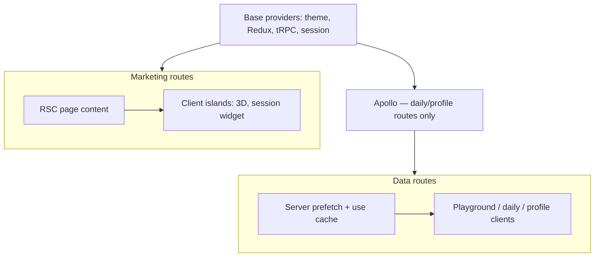

# RSC-first App Router refactor — phased plan

## Status (2026-09)

**Phase 1 (done)** — PR #187 on `cursor/rsc-improvements-b999`:

- Route groups `(marketing)` / `(app)`; Apollo only on data routes
- Privacy policy server-rendered (`PrivacyPageContent` RSC + `PrivacyPageShell` client chrome)
- Playground server prefetch (`getPlaygroundInitialData` + tRPC `initialData`)
- `LocaleAppPageShell` as Server Component; `ProjectBrowser` via `dynamic(..., { ssr: false })`
- `loading.tsx` for playground + profile instant routes
- Layout comment fix (session is resolved in layout, not Suspense-streamed)

---

## Phase 2 — Cache + navigation polish (mostly done)

| Item | Effort | Status |
|------|--------|--------|
| `'use cache'` on public playground SEO DB reads | Small | Done |
| `revalidateTag` on project admin mutations | Medium | Done |
| Session-aware private project SEO metadata | Medium | Done |
| `startTransition` on playground slug navigations | Small | Done |
| `loading.tsx` for `/daily` | Small | Done |
| Remove redundant playground `<Suspense>` (use `loading.tsx`) | Small | Done |
| Cached anonymous `allBrief` in server prefetch | Medium | Done |
| Server canonical playground redirect (project/case/solution) | Medium | Done |
| Apollo scoped to daily/profile only (not playground) | Medium | Done |
| Daily + profile GraphQL server prefetch | Medium | Done |
| `loading.tsx` for marketing `/` and `/privacy` | Small | Done |
| ProjectBrowser scoped to playground layout | Medium | Done |
| Mobile `?view=code` in server canonical redirect | Small | Done |

---

## Phase 3 — Marketing RSC islands

| Item | Effort | Notes |
|------|--------|-------|
| Split `MarketingHomeView` into RSC sections + client islands | Medium | Hero copy, FAQ, sections as server; 3D preview + scroll hooks client |
| `DailyPageView` shell as RSC | Medium | Server prefetch done; interactive bits remain client |
| Remove duplicate locale loads in page modules | Small | Prefer `loadI18nForLocale` / layout-passed `LL` everywhere |

**Success criteria:** `/` and `/daily` ship meaningful HTML without waiting for client hydration; WebGL/Monaco remain client-only.

---

## Phase 4 — Provider + data stack slimming

| Item | Effort | Notes |
|------|--------|-------|
| Extract `MainAppBarProfileImageSync` (lazy, session-gated) | Small | Isolates tRPC mutation; does **not** remove `TrpcProvider` while signed-in users browse marketing |
| Server Action for profile image upload | Medium | Would allow dropping tRPC from marketing for signed-out users |
| tRPC RSC / `createCaller` prefetch helpers | Medium | Replace ad-hoc `getPlaygroundInitialData` with shared `prefetchProjectQueries` |
| Consolidate profile on tRPC **or** GraphQL (not both) | Large | Profile uses GraphQL; playground uses tRPC |

**Success criteria:** Marketing routes mount fewer client providers when signed out; one server-fetch path per feature.

---

## Phase 5 — Edge + Server Actions (optional)

| Item | Effort | Notes |
|------|--------|-------|
| Edge Route Handlers for read-only public config | Medium | Only where latency wins are measurable |
| Server Actions for cookie consent / simple settings forms | Small | Progressive enhancement, `revalidateTag` |
| Broader `useTransition` on filters, project browser search | Small | Pair with Instant Nav |

---

## Architecture target

---

## References

- `vibe-docs/Instant-Navigations-Design.md` — PPR / `instant = true` patterns
- `vibe-docs/App-Router-Migration-Plan.md` — migration complete (P6–P10)
- Review thread that spawned Phase 1 (2026-09)
